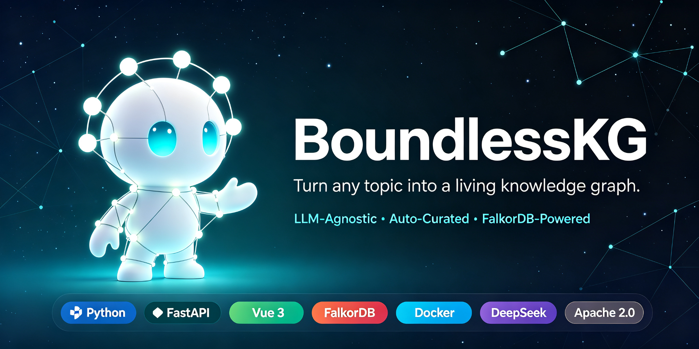
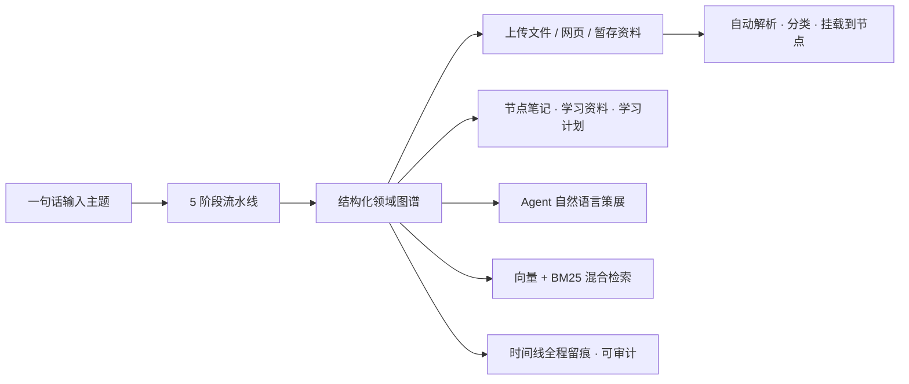
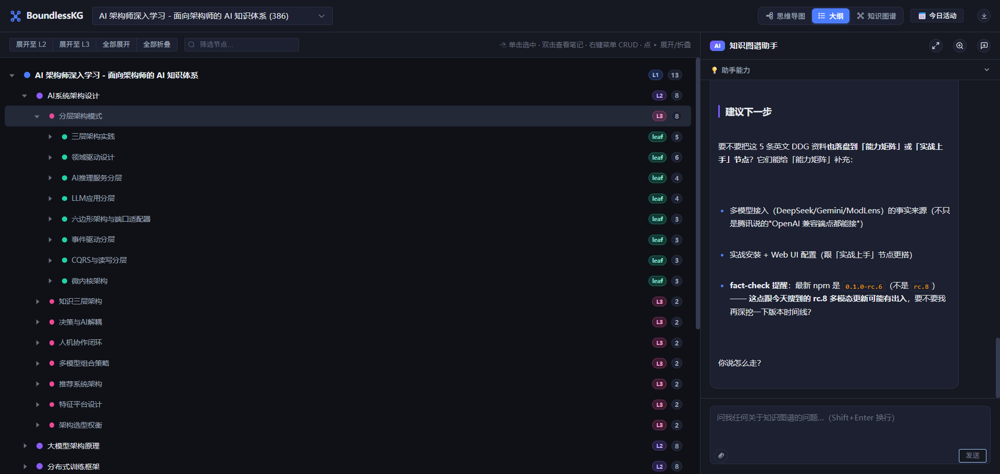
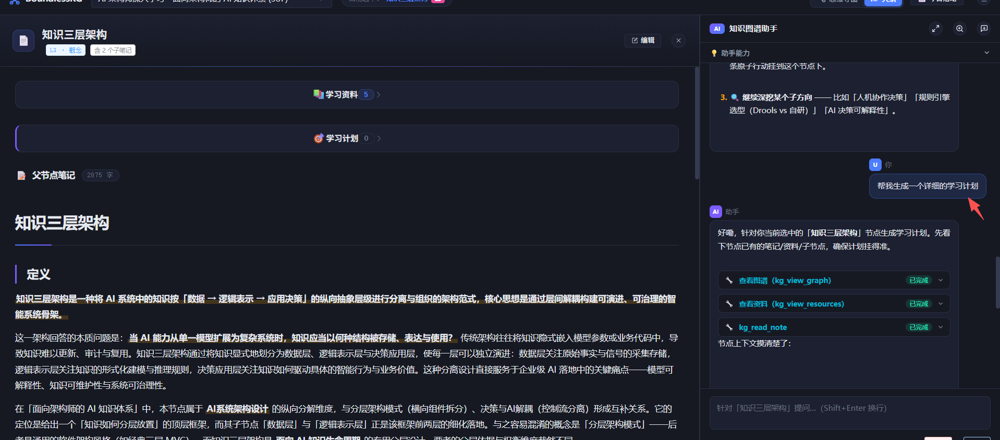
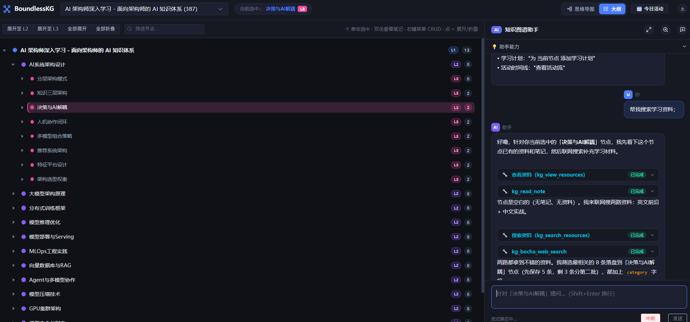
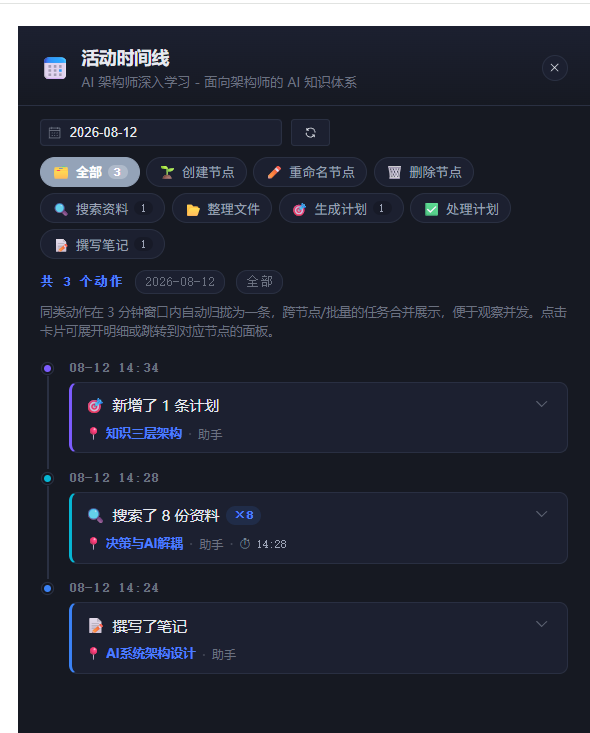

<div align="center">

# BoundlessKG

**给任意主题，一键生成可浏览、可检索、可对话的结构化知识图谱。**

从「一句话」到「一张可持续演化的领域图谱」——让 AI 成为你的知识策展师，而不是临时的问答机器。

[🚀 五分钟快速开始](#-五分钟快速开始) · [✨ 为什么选它](#-为什么选它) · [🖼 界面一览](#-界面一览) · [🎯 核心能力](#-核心能力) · [🏗 架构](#-架构) · [📚 完整文档](https://docs.boundless-kg.dev)



</div>

---

## 💡 它是什么

BoundlessKG 是一个**生产级知识图谱策展引擎**。给它一个主题，它会自动帮你完成从「信息收集」到「知识沉淀」的完整闭环：

> **输入一个主题 → AI 生成结构化领域图谱 → 上传的资料自动解析、归类、挂载到图谱节点 → 每个节点再长出笔记、资源和学习计划 → 全程可以对话、可以检索、可以回溯。**

它不是玩具 demo，也不是单一行业的工具——学术综述、产品调研、技术决策树、跨领域学习路径……只要你想把**离散资料沉淀成可推理的结构**，它都能跑通。

---

## ✨ 为什么选它

- 🧠 **一句话生成领域图谱** —— 5 阶段流水线（意图解析 → 关键词提取 → 多层子树扩展 → 图谱合成 → 持久化）自动产出结构化节点与关系，支持后台进度查询与断点续跑。
- 📄 **资料自动入图** —— 上传 PDF / Word / PPT / Excel / 图片，自动解析正文并挂载到对应图谱节点；网上搜索的资料也会自动分类（论文 / 文档 / 教程 / 视频 / 网页），不再是躺在文件夹里的一堆文件。
- 🗂 **文件暂存 + AI 自动整理** —— 随手丢进暂存区的文件，AI 会帮你判断该归到哪个节点、哪个主题下，把「待整理」变成「已归档」。
- 🔍 **知识图谱 + 混合检索** —— FalkorDB 维护关联图与向量，BM25 + 向量双通道检索。既能沿着图谱结构「找到它」，也能用语义「想起它」。
- 🗓 **自动规划学习路径** —— 围绕主题或节点自动生成可勾选的学习计划（Action 状态机），每个节点都能长出「怎么学」的路线。
- 🤖 **Agent 自然语言策展** —— deepagents 编排 **53 个** LangChain 工具 + SSE 流式对话，说一句「帮我把 RAG 的资料整理到向量检索节点下」，它就真的去做。
- 🧠 **提示词卡片系统** —— per-turn 动态提示词增强，按触发条件自动注入行为规范，不把规则写死在 system prompt 里，行为可调可控。
- 🛡 **全链路可审计** —— 每一次生成、编辑、Agent 操作都通过事件总线写入时间线（JSONL），你可以回放、审查，不把「AI 做了什么」当黑盒。
- 🔌 **LLM 无关、可降级** —— 聊天 / 生成 / 笔记可以各用各的模型（MiniMax · DeepSeek · 任意 OpenAI 兼容 · Mock），FalkorDB 挂了自动回退 JSON，零密钥也能离线跑通。

### 一次典型的用户旅程



---

## 🖼 界面一览



左侧思维导图/ 大纲 / 知识图谱三视图浏览图谱，右侧 AI 知识图谱助手随时待命——从生成、整理到规划，全在一个界面里完成。



每个节点都有自己的「学习资料」与「学习计划」，笔记可自动生成也可手动精修。



让助手联网搜索资料，它会自动筛选、分类、分批落盘到节点。



「今日活动」时间线把每一次新增、编辑、搜索都记录在案，同类操作自动归并，点击即可跳回对应节点。

---

## 🚀 五分钟快速开始

### 0. 环境要求

- **Python** ≥ 3.10（推荐 3.12）
- **Node.js** ≥ 18（仅前端开发需要）
- **FalkorDB** ≥ 1.0（`docker run -p 6379:6379 falkordb/falkordb`，或直接用云服务 / 自动降级）
- 至少一个 LLM 密钥（MiniMax / DeepSeek / 任意 OpenAI 兼容端点；不配密钥也能以 Mock 模式跑通）

> 💡 **Docker 一键启动**：如果已安装 Docker，可直接 `docker compose up -d`，跳到第 4 步。详见 [Docker 部署指南](docs/used/Docker部署运行指南.md)。

### 1. 安装

```bash
git clone https://github.com/q85064972/boundless-kg.git boundless_kg && cd boundless_kg

# 后端（基础）
python -m pip install -e .

# 可选：开发 / Agent 依赖
python -m pip install -e ".[dev]"
python -m pip install -e ".[deepagents]"
```

### 2. 配置

```bash
cp .env.example .env
```

最小可用 `.env`（MiniMax，Anthropic 兼容）：

```bash
ANTHROPIC_API_KEY=sk-...
ANTHROPIC_BASE_URL=https://api.minimaxi.com/anthropic
ANTHROPIC_MODEL=MiniMax-M3-512k
KG_LLM_PROVIDER=minimax
```

或用 DeepSeek（图谱生成更快）：

```bash
DEEPSEEK_API_KEY=sk-...
KG_LLM_PROVIDER=deepseek
# Agent 聊天用 MiniMax / 图谱生成用 DeepSeek（拆分策略，两个模型各司其职）
KG_GENERATION_LLM_PROVIDER=deepseek
```

### 3. 启动

```bash
# 方式 A：控制台脚本（推荐）
kg-engine serve

# 方式 B：直接 uvicorn（必须 --factory，否则 lifespan 不触发）
python -m uvicorn src.api.server:create_app --factory --host 0.0.0.0 --port 8888

# 前端 dev server（可选）
cd frontend-vue && npm install && npm run dev
```

> ⚠️ **注意**：Python 包路径是 `src/`（不是 `kg_engine`），所以 `python -m kg_engine` **不可用**。请使用控制台命令 `kg-engine`，或 `python -m src.cli`。

| 入口 | 地址 |
| --- | --- |
| 前端 UI | <http://localhost:5175> |
| API 文档（Swagger） | <http://localhost:8888/docs> |
| 健康检查 | <http://localhost:8888/api/health> |

### 4. Hello World：生成你的第一个领域

```bash
# CLI：一行生成（阻塞直到完成）
kg-engine generate "RAG 检索增强生成" --wait

# 或通过 API 让 Agent 帮你做
curl -X POST http://localhost:8888/api/agent/invoke \
  -H "Content-Type: application/json" \
  -d '{"message":"帮我创建一个名为 RAG 检索增强 的领域图谱"}'
```

打开前端，在左侧选择 **graph** 视图即可浏览刚刚生成的图谱。🎉

---

## 🎯 核心能力

| 模块 | 能力 | 代码入口 |
| --- | --- | --- |
| **图谱生成** | 5 阶段流水线自动产出节点 / 关系 / 子树，支持后台进度查询与重启续跑 | `src/application/generation_pipeline.py` |
| **图谱浏览** | 装饰后视图（层级 / tier / L0 根节点）+ 节点 CRUD + 反向链接修复 | `src/application/graph_service.py`、`src/domain/graph/decorator.py` |
| **笔记** | LLM 生成 + 摘要提取 + 字数统计 + 子节点笔记索引 | `src/application/note_service.py`、`src/domain/note/generator.py` |
| **资源** | 联网搜索 / 文件上传 / 文件暂存 / 13 种格式预览 / 资料自动分类归档 | `src/application/resource_service.py`、`src/application/tmp_parser.py` |
| **计划** | 围绕主题/节点生成学习计划 + Action 状态机 + 历史数据迁移 | `src/application/plan_service.py` |
| **关联图** | LLM 抽取语义关系层（PART_OF / PREREQUISITE_OF / SIMILAR_TO / …）+ FalkorDB 同步 | `src/application/association_service.py`、`src/infrastructure/graph_store/` |
| **节点档案** | 异步经验沉淀（dossier reflector），时间衰减 + 跨节点检索 | `src/application/dossier_service.py`、`src/agent/reflection/` |
| **Agent 对话** | deepagents + 53 个工具 + SSE 流式 + 卡片中间件 + 沙箱 shell | `src/agent/orchestrator.py`、`src/agent/tools/` |
| **提示词卡片** | 动态 per-turn 提示词增强，按触发条件自动注入 system prompt | `src/agent/cards/` |
| **时间线** | 事件总线驱动的活动流，所有写操作自动留痕（JSONL） | `src/observability/activity_*.py` |
| **会话记忆** | Agent 对话持久化、按天/会话检索、记忆召回 | `src/api/routes/memory.py`、`src/agent/memory.py` |
| **校验** | 6 维度质量评分（excellent / good / fair / poor）+ 修复建议 | `src/domain/graph/validator.py` |

---

## 🏗 架构

三层架构 + Domain Protocol 反转：`domain` 是纯领域（零 IO），`infrastructure` 通过 Protocol 反哺，`application` 编排业务流，`api / cli / agent` 是面向用户的薄层。

```
┌─────────────────────────────────────────────────────────────────────┐
│  api (FastAPI 路由)   ·   cli (argparse)   ·   agent (deepagents)    │
│         │                       │                       │            │
│         └───────────────────────┼───────────────────────┘            │
│                                 ▼                                    │
│                      application (服务编排层)                          │
│            GraphService · NoteService · ResourceService              │
│            PlanService · GenerationPipeline · AssociationService     │
│            DossierService · CardService · GraphSyncOrchestrator      │
│                                 │                                    │
│                                 ▼                                    │
│                         domain (纯领域模型)                            │
│         Graph / Node / Direction / QualityScore / Association        │
│         NoteGenerator / IntentParser / HotKeyword / Protocols        │
│                                 ▲                                    │
│                                 │ 实现 Protocol 接口                   │
│  infrastructure (IO 层)                                               │
│    repository: graph / note / resource / plan / timeline / assoc /   │
│                dossier                                                │
│    llm:       OpenAI 兼容 · Anthropic 兼容 · Mock · Factory           │
│    search:    Bocha · DuckDuckGo · mmx · 自适应 Preference             │
│    embedding: EmbeddingClient · BM25Index · 混合检索                    │
│    graph_store: GraphStoreClient (FalkorDB)                           │
│    wiki:      WikipediaClient                                         │
└─────────────────────────────────────────────────────────────────────┘
```

**依赖方向铁律**：`api / cli / agent → application → domain ← infrastructure`。新增一个 LLM 或搜索后端，不需要改动任何业务代码。

---

## 🧩 技术栈

| 层 | 选型 | 为什么 |
| --- | --- | --- |
| 后端 | Python 3.10+ · FastAPI · pydantic v2 | 异步、类型安全、自带 OpenAPI |
| Agent | deepagents · langchain · langgraph | 53 个工具 + 多回合编排 + 流式输出 |
| 图谱存储 | FalkorDB | 关联图 + 向量 + BM25 混合检索，可自动降级 JSON |
| 检索 | Embedding + BM25 混合加权 | 结构检索 + 语义检索双通道 |
| LLM | MiniMax / DeepSeek / OpenAI 兼容 / Mock | 按角色（聊天 / 生成 / 笔记）独立配置，LLM 无关 |
| 搜索 | Bocha · DuckDuckGo · mmx | 自适应调度，失败自动隔离与重试 |
| 前端 | Vue 3 · Vite · TypeScript · D3 · Mermaid | 图谱 / 大纲 / 关联三视图 + 13 种文件预览 |
| 部署 | Docker Compose | api + FalkorDB + 持久化卷，一键启动 |

---

## 🧰 场景示例

| 场景 | 怎么用 |
| --- | --- |
| 🎓 **学术综述** | 输入「RAG 检索增强生成」，生成领域图谱 → 对关键节点生成笔记 → 让助手搜索论文/教程挂到节点 → 生成两周学习计划 |
| 📊 **产品调研** | 输入「竞品分析：企业知识库」，生成竞品结构图谱 → 上传竞品白皮书，AI 自动解析挂载 → 让助手归纳差异点 |
| 🛠 **技术决策** | 输入「向量数据库选型」，指定方向为「技术决策」生成决策树 → 每个候选方案收集资料 → 时间线留档决策过程 |
| 🧑‍🎓 **个人学习** | 任何想学的主题都能变成一张「第二大脑」图谱，资料、笔记、计划、进度全部沉淀在一起，长期演化 |

更多端到端配方见 [Cookbook](https://docs.boundless-kg.dev)。

---

## 📚 深度参考

<details>
<summary><b>Agent 工具矩阵（53 个，按域分组）</b></summary>

| 分组 | 说明 | 示例工具 |
| --- | --- | --- |
| 图谱管理 | 领域 / 节点 / 子树的增删改查与校验 | `kg_list_domains` · `kg_add_node` · `kg_add_subtree` · `kg_fix_links` · `kg_validate_graph` |
| 笔记 | 生成 / 读取 / 列出节点笔记 | `kg_generate_note` · `kg_read_note` |
| 资源 | 联网搜索 / 查看 / 挂载学习资料 | `kg_search_resources` · `kg_add_learning_resources` |
| 搜索 | 网页搜索 / 图谱全局搜索 / 邻居查询 | `kg_bocha_web_search` · `kg_global_search` · `kg_graph_neighbors` |
| 文件暂存 | 上传文件 → AI 归类 → 挂到节点 | `kg_stage_file` · `kg_classify_pending` · `kg_create_node_with_resource` |
| 流水线 | 启动 / 查询图谱生成任务 | `kg_run_skill` · `kg_check_status` |
| 计划 | 学习计划的增删改与状态推进 | `kg_add_plan` · `kg_update_plan_status` |
| 时间线 | 查看活动流 | `kg_view_timeline` |
| 卡片 | 提示词卡片管理 | `kg_add_card` · `kg_view_card` |
| 会话记忆 | 跨会话关键词检索与召回 | `kg_search_memory` · `kg_recall_session` |
| 关联图 | 语义关系层的查看 / 同步 / 增删边 | `kg_view_associations` · `kg_sync_associations` · `kg_add_edge` |
| 节点档案 | 经验沉淀的读写与检索 | `kg_add_dossier_entry` · `kg_search_dossier` |
| 临时文件 | 上传文件的解析 / 删除 / 自动归档 | `kg_parse_uploaded_file` · `kg_auto_place_uploaded_file` |

工具数一致性由 `tests/unit/test_tool_count_consistency.py` 守护，防止「注册了但没暴露」的隐性 bug。

</details>

<details>
<summary><b>CLI 子命令</b></summary>

```bash
# 服务
kg-engine serve                                                    # 启动 API

# 图谱生成（5 阶段流水线）
kg-engine generate "RAG 检索增强" --wait                           # 阻塞直到完成
kg-engine generate "Foo" --direction-hint=技术决策                 # 指定方向

# 校验与报告
kg-engine validate <domain_id>                                     # 校验 + 质量评分（可接 CI）
kg-engine report  <domain_id>                                      # 打印图谱 + 报告

# 提示词卡片
kg-engine cards list / add <id> --title "..." --body "..." / delete / view

# 关联图（FalkorDB / associations.json）
kg-engine associations sync / sync-node / extract / stats / clear
```

</details>

<details>
<summary><b>API 端点速览</b></summary>

完整规范由 FastAPI 自动生成，启动服务后访问 <http://localhost:8888/docs> 交互式 Swagger UI。

| 模块 | 端点 |
| --- | --- |
| **健康** | `GET /api/health` |
| **图谱与节点** | `GET /api/domains` · `GET /api/graph/{domain}` · `POST /api/nodes` · `PATCH/DELETE /api/nodes/{domain}?name=...` · `POST /api/graph/{domain}/fix-links` · `GET /api/graph/{domain}/export-zip` |
| **笔记** | `GET/PUT /api/notes/{domain}?node=...` · `POST /api/notes/{domain}/generate?node=...` · `GET /api/notes-index/{domain}?node=...` |
| **资源** | `GET /api/resources/{domain}?node=...` · `POST/DELETE/PUT .../web` · `POST .../upload` · `GET .../download/{filename}` · `GET .../study-materials?path=...` |
| **计划** | `GET/POST /api/plans/{domain}?node=...` · `PUT/DELETE .../{plan_id}` · `PUT .../actions/{aid}` |
| **时间线** | `GET /api/timeline/{domain}?date=&node=&type=` |
| **记忆** | `GET /api/memory/sessions?days=` · `GET /api/memory/search` · `GET /api/memory/recall?lines=` |
| **关联图** | `GET /api/associations/{domain}` · `/concepts` · `/edges` · `/neighbors` · `POST .../sync` · `/sync-node` |
| **搜索** | `GET /api/search/{domain}` · `GET /api/search/{domain}/global` · `GET /api/graph/{domain}/neighbors` |
| **Agent** | `POST /api/agent/invoke`（SSE 流式） · `POST /api/agent/session` |
| **临时文件** | `POST /api/upload` · `GET /api/list` · `DELETE /api/{filename}` · `GET /api/parse/{filename}` · `POST /api/auto-place` |

</details>

<details>
<summary><b>配置速览（最常用）</b></summary>

完整变量见 [`.env.example`](.env.example)（含注释）与 [`src/config/settings.py`](src/config/settings.py)。

| 角色 | 变量 | 默认 | 说明 |
| --- | --- | --- | --- |
| **LLM** | `KG_LLM_PROVIDER` | `mock` | Agent 聊天：`mock` / `minimax` / `deepseek` / `openai` |
| | `KG_GENERATION_LLM_PROVIDER` | 空 → 回退 | 图谱生成 / 笔记 / 资源分类 |
| | `KG_NOTE_LLM_PROVIDER` | 空 → 回退 | 仅笔记生成 |
| | `KG_LLM_REASONING_EFFORT` | 空 | `low` / `medium` / `high` / `max` / `xhigh` |
| **API** | `KG_API_HOST` / `KG_API_PORT` | `0.0.0.0` / `8888` | FastAPI 监听 |
| **Agent** | `KG_AGENT_RECURSION_LIMIT` | `250` | deepagents 递归上限 |
| | `KG_AGENT_CARDS_ENABLED` | `false` | 提示词卡片中间件 |
| | `KG_AGENT_SHELL_ENABLED` | `true` | 是否暴露 `kg_shell_exec` 沙箱 |
| **路径** | `KG_KB_ROOT` | `./workspace/knowledge_bases` | 知识库根 |
| **Search** | `KG_SEARCH_ADAPTIVE` | `true` | 自适应后端选择 |
| | `KG_SEARCH_QUARANTINE_SEC` | `21600` | 失败后端隔离时长 |
| **FalkorDB** | `KG_FALKORDB_ENABLED` | `true` | 全局开关 |
| | `KG_ASSOCIATIONS_SOURCE` | `auto` | `auto` / `falkordb` / `json`（可自动降级） |
| **Embedding** | `KG_SEARCH_BM25_WEIGHT` | `0.4` | BM25 权重 |
| | `KG_SEARCH_VECTOR_WEIGHT` | `0.6` | 向量权重 |

任何缺失的必填密钥都会以 `EnvironmentError` 抛出，**绝不**回退到源码硬编码。

</details>

<details>
<summary><b>顶层目录</b></summary>

```text
.
├── README.md                     # 本文档
├── pyproject.toml                # 后端依赖与打包（包名 kg-engine，控制台脚本 kg-engine）
├── Dockerfile / docker-compose   # 镜像构建与服务编排
├── .env / .env.example           # 运行配置（.env 已 gitignore）
├── assets/screenshots/           # README 界面截图
├── src/                          # 后端代码
│   ├── api/                      # FastAPI 路由 + 中间件 + lifespan
│   ├── cli/                      # argparse 子命令
│   ├── agent/                    # deepagents 编排 + 53 工具 + 中间件链
│   ├── application/              # 服务编排层（Graph/Note/Resource/Plan/Pipeline/...）
│   ├── domain/                   # 纯领域模型 + Protocol 接口
│   ├── infrastructure/           # Repo / LLM / Search / Embedding / FalkorDB 实现
│   ├── observability/            # ActivityBus / JSONL / Reader / Derivation
│   ├── skills/                   # 打包的外部 CLI 技能（PDF/PPTX/DOCX/Digest）
│   └── config/                   # pydantic-settings
├── frontend-vue/                 # Vue 3 SPA（图谱/大纲/关联三视图 + 13 种文件预览）
├── tests/                        # ~600 unit + ~70 integration
├── docs/                         # 内部设计稿与运维文档
└── workspace/                    # Agent 工作区（gitignore 内）
    ├── AGENTS.md                 # 策展记忆（受版本控制）
    └── knowledge_bases/          # 领域知识（gitignored）
```

</details>

<details>
<summary><b>测试</b></summary>

```bash
pytest -q                          # 全部（~600 unit + ~70 integration）
pytest tests/unit -q               # 仅单元
pytest tests/integration -q        # 集成（需要 FalkorDB 跑起来）
```

`tests/conftest.py` 提供 `tmp_kb_root` / `tmp_workspace_dir` / `_reset_graph_lock` 等夹具，确保测试间不污染全局状态。

</details>

---

## 📚 完整文档

本 README 是项目门面，深度内容见文档站点：

- 🚀 **快速开始** — 安装 / 配置 / 5 分钟跑通 / Hello World
- 🧠 **核心概念** — 架构 / 分层 / 数据模型 / 事件总线 / Agent 系统
- 📖 **使用指南** — 5 阶段流水线拆解 / 笔记 / 资源 / 计划 / 档案 / 卡片 / 上传解析
- 🔌 **集成** — LLM / 搜索 / FalkorDB / Embedding / 前端 / 外部 Skills
- 🛠 **API 参考** — 按子模块组织的完整接口文档
- 🚢 **部署** — Docker / WSL2 / 环境变量全集 / 生产建议
- 🍳 **Cookbook** — 学术 / 产品 / 技术决策等典型场景配方

---

## 🤝 贡献

代码改动请直接 PR。设计稿 / 重构提案可放进 [`docs/used/`](docs/used/)。

- **添加新工具**：参考 [`src/agent/tools/`](src/agent/tools/) 内任意文件，按 `@tool` 装饰器模式写
- **添加新 LLM / Search Provider**：实现 [`src/domain/protocols.py`](src/domain/protocols.py) 中的 Protocol
- **添加新 Skill**：放在 [`src/skills/<name>/`](src/skills/)，CLI 入口可被 `SkillRunner` 自动发现

---

## 📜 License

[Apache License 2.0](LICENSE) — 自由使用、修改、分发，含专利授权；需保留版权声明与 NOTICE。生产部署请自行评估合规。

---

<div align="center">

**BoundlessKG** — 让 AI 成为你的知识策展师。

如果这个项目对你有帮助，欢迎 ⭐ Star 支持！

</div>
