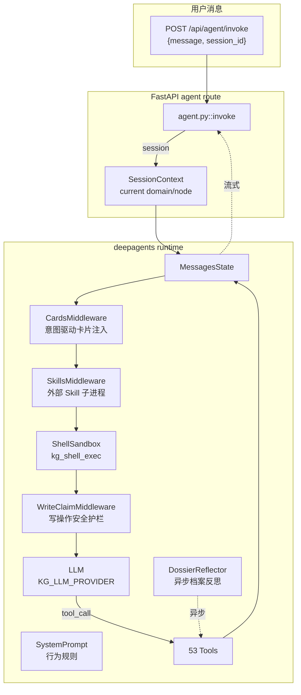

## 一句话

**deepagents 框架编排 + 53 个 LangChain @tool + 5 个 middleware（卡片 / Skills / 沙箱 shell / 写声明 / dossier 反思）+ SSE 流式输出。**

## 整体架构



## 工具目录（53 个，按域分组）

总计由 `tests/unit/test_tool_count_consistency.py` 守护。

### 图谱管理（9）

| 工具 | 用途 |
| --- | --- |
| `kg_list_domains` | 列出所有领域 |
| `kg_view_graph` | 获取装饰后图谱 |
| `kg_add_node` | 添加节点 |
| `kg_add_subtree` | 批量添加子树 |
| `kg_fix_links` | 修复反向链接 |
| `kg_delete_node` | 删除节点（可中断确认） |
| `kg_update_node` | 更新节点属性 |
| `kg_validate_graph` | 校验 + 评分 |
| `kg_open_node` | 打开节点详情 |

### 笔记（3）

| 工具 | 用途 |
| --- | --- |
| `kg_generate_note` | 为指定节点生成 Markdown 笔记；已存在则复用（除非 force=True） |
| `kg_read_note` | 读取节点已有笔记完整内容；不存在返回提示，不触发 LLM 生成 |
| `kg_list_notes` | 列出某领域下所有已有笔记的节点名 |

### 资源（3）

| 工具 | 用途 |
| --- | --- |
| `kg_search_resources` | 联网搜索学习资料，返回 JSON 数组 |
| `kg_view_resources` | 查看某节点已保存的资料，返回 JSON |
| `kg_add_learning_resources` | 把搜索结果批量落盘到节点级资料索引 |

### 搜索（5）

| 工具 | 用途 |
| --- | --- |
| `kg_bocha_web_search` | 使用 Bocha AI Search 联网搜索，返回 JSON |
| `kg_set_search_channel` | 把用户首选搜索渠道持久化为指定 channel |
| `kg_clear_search_channel` | 清除首选搜索渠道设置，恢复自适应 fallback |
| `kg_global_search` | 全局语义搜索，理解领域内所有相关资源及其关联 |
| `kg_graph_neighbors` | 查询节点的 N 跳邻居（图遍历） |

### 文件暂存（3）

| 工具 | 用途 |
| --- | --- |
| `kg_stage_file` | 把本地文件移动到暂存区 |
| `kg_classify_pending` | AI 归类暂存文件应挂到哪个节点下 |
| `kg_create_node_with_resource` | 新建节点 + 把本地文件挂到该节点下 |

### 流水线（2）

| 工具 | 用途 |
| --- | --- |
| `kg_run_skill` | 异步触发图谱生成流水线，返回 task_id |
| `kg_check_status` | 查询图谱生成任务进度 |

### 计划（4）

| 工具 | 用途 |
| --- | --- |
| `kg_add_plan` | 为某个知识节点添加一条学习计划 |
| `kg_delete_plan` | 删除一条学习计划（node 留空自动查找所属节点） |
| `kg_list_plans` | 列出学习计划（node 留空=列出该领域所有节点） |
| `kg_update_plan_status` | 更新计划或单条行动的状态 |

### 时间线（1）

| 工具 | 用途 |
| --- | --- |
| `kg_view_timeline` | 查看领域活动时间线（计划 + 资料 + 笔记），按时间倒序 |

### 卡片（4）

| 工具 | 用途 |
| --- | --- |
| `kg_add_card` | 创建或更新一张提示词卡片 |
| `kg_list_cards` | 列出所有已加载的提示词卡片（id / 标题 / 触发条件 / 优先级） |
| `kg_view_card` | 查看一张卡片的完整内容（含正文） |
| `kg_delete_card` | 删除一张提示词卡片（不存在时返回提示，不报错） |

### JSON 修复（1）

| 工具 | 用途 |
| --- | --- |
| `kg_repair_json` | 兜底修复 LLM 返回的非法 JSON，返回可解析结果 |

### 会话记忆（3）

| 工具 | 用途 |
| --- | --- |
| `kg_search_memory` | 搜索历史对话记忆，查找过往会话中的相关内容 |
| `kg_recall_recent` | 回顾最近的对话历史（默认最新会话的最后 60 条） |
| `kg_recall_session` | 按 session_id 加载指定历史会话的完整记录 |

### 关联图（6）

| 工具 | 用途 |
| --- | --- |
| `kg_view_associations` | 查看某领域的完整关联图（JSON） |
| `kg_query_neighbors` | 查询节点的 N 跳邻居 |
| `kg_sync_associations` | 触发某领域全量派生（重建关联索引） |
| `kg_sync_node_associations` | 单节点增量派生 |
| `kg_add_edge` | 手动新增一条概念 ↔ 概念 关联边 |
| `kg_delete_edge` | 手动删除一条关联边 |

### 节点档案（5）

| 工具 | 用途 |
| --- | --- |
| `kg_add_dossier_entry` | 往节点档案追加一条经验条目 |
| `kg_view_dossier` | 查看一个节点的完整档案（按类型分组） |
| `kg_search_dossier` | 跨节点搜索档案条目 |
| `kg_update_dossier_entry` | 更新一条档案条目（标题 / 正文 / 标签 / 重要性） |
| `kg_remove_dossier_entry` | 删除一条档案条目 |

### 临时文件（4）

| 工具 | 用途 |
| --- | --- |
| `kg_list_uploaded_files` | 查看暂存区里用户上传了哪些文件 |
| `kg_parse_uploaded_file` | 解析用户上传的文件，返回分类信息 + 短预览 |
| `kg_delete_uploaded_file` | 从暂存区删除一个用户上传的文件 |
| `kg_auto_place_uploaded_file` | 自动解析 + 归类 + 放到正确的节点下（一键整理） |

## Middleware 链

### 1. CardsMiddleware（意图驱动卡片）

`src/agent/cards/`：

```python
# 简化示意
class CardsMiddleware:
    async def pre_llm(self, messages, **kwargs):
        triggers = detect_triggers(messages[-1])  # 当前轮触发条件
        cards = self.library.match(triggers, current_tools=kwargs.get("tools"))
        if cards:
            messages[0] = augment_system_message(messages[0], cards)
        return messages
```

**默认禁用**（`KG_AGENT_CARDS_ENABLED=false`），v1.1 评估通过后开启。

详见 [提示词卡片](/guides/cards)。

### 2. SkillsMiddleware

把 `src/skills/*` 下的 CLI 工具（如 `minimax-pdf`、`pptx-generator`）作为 `kg_run_skill` 子进程调用。

详见 [外部 Skills](/integrations/skills)。

### 3. ShellSandbox

`kg_shell_exec` 工具，底层 `deepagents.LocalShellBackend`，根目录固定在 `KG_KB_ROOT`。

```python
@tool
async def kg_shell_exec(cmd: str, timeout: int | None = None) -> str:
    """沙箱 shell。默认禁用请设 KG_AGENT_SHELL_ENABLED=false。"""
```

### 4. WriteClaimMiddleware（写声明护栏）

强制 Agent 在调用"破坏性工具"前声明意图：

```text
User: 删除节点 ColBERT
Agent: 我打算删除 ColBERT，因为它是过时论文的引用。
       是否继续？(yes/no)
User: yes
Agent: [调用 kg_delete_node]
```

可通过 `KG_AGENT_INTERRUPT_ON_DELETE=false` 关掉。

### 5. DossierReflector（异步档案反思）

监听 `NOTE_SAVED` / `NODE_UPDATED` 事件，**异步**抽取经验沉淀到 `Dossier`。

详见 [节点档案](/guides/dossiers)。

## LLM 提供方选择

| 角色 | 配置 | 默认 |
| --- | --- | --- |
| Agent 聊天 | `KG_LLM_PROVIDER` | `mock` |
| 图谱生成 | `KG_GENERATION_LLM_PROVIDER` | 回退到 `KG_LLM_PROVIDER` |
| 笔记生成 | `KG_NOTE_LLM_PROVIDER` | 回退到 `KG_GENERATION_LLM_PROVIDER` |

详见 [LLM 集成](/integrations/llm-providers)。

## 会话持久化

每次 Agent 调用都会：

1. 写到 `workspace/.agent_memory/conversations/&lt;session_id&gt;.jsonl`（永久保留）
2. 可通过 `/api/memory/sessions?days=7` 查询
3. 可通过 `/api/memory/search?q=...` 全文搜索

详见 [记忆 API](/api-reference/memory)。

## 下一步

<CardGroup cols={2}>
  <Card title="SSE 流式对话" icon="stream" href="/guides/sse-chat">
    前端怎么接、中断怎么传
  </Card>
  <Card title="提示词卡片" icon="note-sticky" href="/guides/cards">
    行为规范怎么动态注入
  </Card>
  <Card title="Agent API" icon="code" href="/api-reference/agent">
    完整接口 + SSE 帧格式
  </Card>
</CardGroup>
