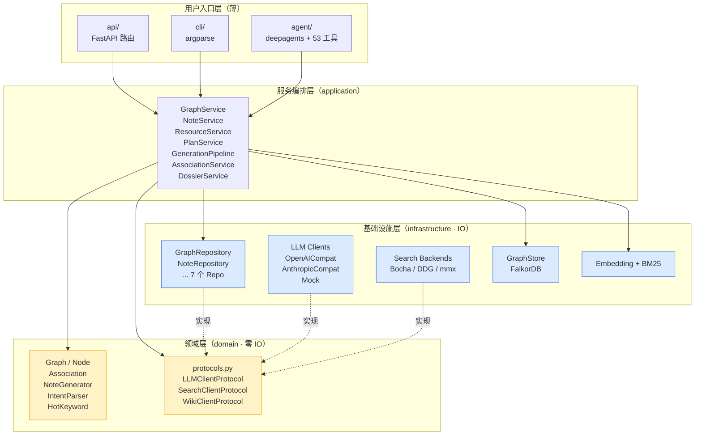
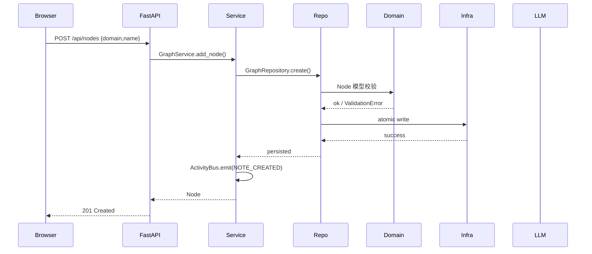

## 一句话架构

**面向用户的薄层（api/cli/agent）→ 服务编排层（application）→ 纯领域层（domain）← IO 实现层（infrastructure）。**
`domain` 不知道 `infrastructure` 的存在；后者通过 `protocols.py` 定义的结构化子类型接口反哺。

## 依赖方向图



## 分层职责

| 层 | 职责 | 不允许 |
| --- | --- | --- |
| **用户入口** | 参数解析、请求/响应序列化、流式输出 | 直接文件 IO、直接调用 LLM |
| **application** | 业务流程编排、跨 Repository 协调、事务边界 | 持有具体 IO 实现类型（应只持有 Protocol / Repository 接口） |
| **domain** | 纯业务模型、算法、校验 | 导入 `infrastructure` / `application` / `api` / `agent` 中的任何模块 |
| **infrastructure** | IO 实现、第三方 SDK 适配、原子写、锁 | 引入领域不存在的概念（如 LLM-specific 类型） |

## Protocol 反转

`domain/protocols.py` 定义一组接口契约（Python `Protocol` 类），基础设施层以**结构化子类型**方式实现——不需要显式继承。

```python domain/protocols.py
from typing import Protocol

class LLMClientProtocol(Protocol):
    async def chat(self, messages: list[dict], **kwargs) -> str: ...
    async def chat_structured(self, messages: list[dict], schema: type[T], **kwargs) -> T: ...
```

```python infrastructure/llm/openai_compat.py
class OpenAICompatClient:
    """不需要写 : LLMClientProtocol，靠鸭子类型满足结构子类型。"""
    async def chat(self, messages, **kwargs) -> str: ...
    async def chat_structured(self, messages, schema, **kwargs): ...
```

**好处**：业务代码写 `def chat_with(llm: LLMClientProtocol, ...)`，传任何实现了接口的类都行。换 LLM 提供方零业务改动。

## 一图看懂请求生命周期



## 关键约束（不只是约定，是测试守护的）

1. **零硬编码密钥**：`config.require_secret` 抛错而非回退
2. **单一异步锁**：`infrastructure/lock.py` 保护所有图谱写操作
3. **薄路由**：`api/routes/` 不直接做文件 IO
4. **领域层纯净**：CI 用 `test_domain_*` 测试守护

## 下一步

<CardGroup cols={2}>
  <Card title="分层与依赖反转详解" icon="layer-group" href="/concepts/layering">
    每层的边界、为什么这样切
  </Card>
  <Card title="知识图谱数据模型" icon="diagram-project" href="/concepts/graph-model">
    Graph / Node / Direction / QualityScore
  </Card>
  <Card title="事件总线" icon="timeline" href="/concepts/event-bus">
    ActivityBus / JSONL / 时间线怎么串起来
  </Card>
  <Card title="Agent 与工具系统" icon="robot" href="/concepts/agent-system">
    deepagents + 53 工具 + 中间件链
  </Card>
</CardGroup>
