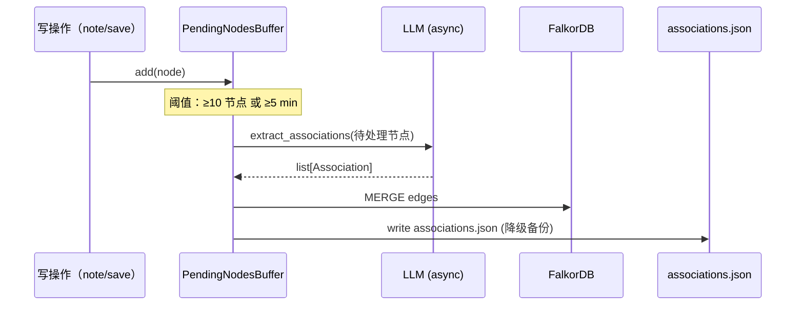

## 概览

`Graph` 描述**领域结构**（节点 + 父子树形边）。`AssociationGraph` 描述**节点之间的关系网络**——是 Graph 之上的语义增强层。

```mermaid
graph LR
  subgraph 领域图谱（Graph）
    N1[ColBERT<br/>L2]
    N2[后期交互<br/>L1]
    N3[BM25<br/>L2]
    N4[稀疏检索<br/>L1]
  end

  subgraph 关联图（AssociationGraph）
    N1 -.PART_OF.-> N2
    N3 -.PART_OF.-> N4
    N3 -.PREREQUISITE_OF.-> N1
    N1 -.SIMILAR_TO.-> BM25_2[BM25 算法]
    N2 -.CONTRASTS_WITH.-> N4
  end

  style N1 fill:#fef3c7
  style N2 fill:#fef3c7
  style N3 fill:#fef3c7
  style N4 fill:#fef3c7
  style BM25_2 fill:#dbeafe
```

## 数据模型

```python domain/graph/association.py
class RelationType(str, Enum):
    PART_OF = "PART_OF"
    PREREQUISITE_OF = "PREREQUISITE_OF"
    SIMILAR_TO = "SIMILAR_TO"
    CONTRASTS_WITH = "CONTRASTS_WITH"
    EXAMPLE_OF = "EXAMPLE_OF"
    REFERENCES = "REFERENCES"  # 节点引用资源

class EdgeIntensity(BaseModel):
    strength: float       # 0-1，关系强度
    confidence: float     # 0-1，LLM 抽取置信度
    source: Literal["llm", "manual", "inferred"]

class ConceptNode(BaseModel):
    name: str                       # 与 Graph.node.name 对齐
    aliases: list[str] = []         # 别名（用于检索消歧）
    last_extracted_at: datetime
    mention_count: int              # 在 notes / resources 中被提及次数

class ResourceNode(BaseModel):
    url: str
    title: str
    resource_type: str              # paper / article / doc / video / ...
    last_indexed_at: datetime

class Association(BaseModel):
    source_id: str                  # ConceptNode.name 或 ResourceNode.url
    source_type: Literal["concept", "resource"]
    target_id: str
    target_type: Literal["concept", "resource"]
    relation: RelationType
    intensity: EdgeIntensity

class AssociationGraph(BaseModel):
    domain: str
    concepts: dict[str, ConceptNode]
    resources: dict[str, ResourceNode]
    associations: list[Association]
    metadata: AssociationMetadata
```

## RelationType 详解

| 类型 | 含义 | L1/L2 节点对举例 |
| --- | --- | --- |
| **PART_OF** | A 是 B 的子部分 | "ColBERT" PART_OF "后期交互" |
| **PREREQUISITE_OF** | 学习 A 才能学 B | "BM25" PREREQUISITE_OF "稀疏检索" |
| **SIMILAR_TO** | 相似但不同 | "ColBERT" SIMILAR_TO "BERT" |
| **CONTRASTS_WITH** | 对比 / 互补 | "稠密" CONTRASTS_WITH "稀疏" |
| **EXAMPLE_OF** | A 是 B 的实例 | "ColBERTv2" EXAMPLE_OF "ColBERT" |
| **REFERENCES** | 节点引用资源 | "后期交互" REFERENCES "&lt;pdf-url&gt;" |

## 抽取流程



**两个保护机制**：
- `PendingNodesBuffer` 防抖：避免每写一次笔记就抽一次 LLM
- 失败隔离：FalkorDB 不可达 → 只写 `associations.json`，不报错

## FalkorDB schema

```cypher
// 概念节点
(:Concept {domain, name, aliases, mention_count})

// 资源节点
(:Resource {domain, url, title, type, last_indexed_at})

// 关联边（带强度 + 置信度）
(:Concept)-[:ASSOCIATED {
  relation: "PART_OF",
  strength: 0.92,
  confidence: 0.87,
  source: "llm"
}]->(:Concept)
```

所有图的前缀 `kg_`（`KG_FALKORDB_GRAPH_PREFIX`），便于多租户隔离。

## 检索使用

```bash
# 全局检索（混合 BM25 + 向量）
GET /api/search/{domain}/global?q=后期交互

# 邻居查询（图遍历）
GET /api/associations/{domain}/neighbors?node=ColBERT&depth=2

# 统计
GET /api/associations/{domain}/statistics
```

详细 API 见 [Associations API](/api-reference/associations) 和 [Search API](/api-reference/search)。

## 配置

```bash .env
KG_FALKORDB_ENABLED=true           # 全局开关
KG_ASSOCIATIONS_SOURCE=auto        # auto/falkordb/json
```

`auto` 模式：FalkorDB 不可达 → 自动降级读 `associations.json`。

## 下一步

<CardGroup cols={2}>
  <Card title="FalkorDB 集成" icon="database" href="/integrations/falkordb">
    图数据库怎么接、降级策略、迁移
  </Card>
  <Card title="Embedding 混合检索" icon="magnifying-glass" href="/integrations/embedding">
    BM25 + 向量混合权重
  </Card>
  <Card title="Associations API" icon="code" href="/api-reference/associations">
    完整接口列表
  </Card>
</CardGroup>
