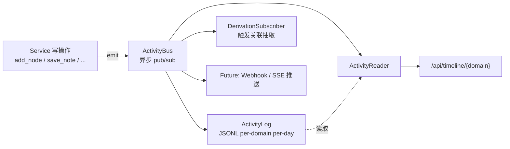

## 设计动机

没有事件总线时的两种坏味道：

1. **写完即忘**：笔记改了、资源加了，没有"系统知道发生过什么"
2. **扫描反推**：要查历史只能 `find . -newer`，结果不准且慢

BoundlessKG 走第三条路：**所有写操作都先 emit 事件，事件同时写 JSONL 日志并通知订阅者**。

## 数据流



## 事件 schema

```python observability/activity_log.py
class ActivityEvent(BaseModel):
    id: str                    # uuid4
    ts: str                    # ISO 时间戳
    date: str                  # YYYY-MM-DD（索引键）
    domain: str
    type: str                  # node_created / note_updated / ...
    node: str                  # 受影响节点（或空）
    title: str                 # 人类可读摘要
    source: str                # manual / agent
    extra: dict[str, Any]     # 事件特定字段
```

## 事件类型目录

| 类别 | 事件 | 触发点 |
| --- | --- | --- |
| 图谱 | `node_created` / `node_updated` / `node_deleted` / `node_renamed` / `node_relinked` | `GraphService` |
| 图谱 | `fix_links` / `graph_synced` / `graph_exported` | 同上 |
| 笔记 | `note_generated` / `note_updated` / `note_rebuilt` | `NoteService` |
| 资源 | `web_resource_added` / `upload_added` | `ResourceService` |
| 计划 | `plan_created` / `plan_action_done` / `plan_action_skipped` / `plan_deleted` | `PlanService` |
| 关联 | `association_created` / `association_deleted` | `AssociationService` |
| 档案 | `dossier_entry_added` / `dossier_entry_updated` / `dossier_entry_removed` | `DossierService` |
| 卡片 | `card_created` / `card_updated` / `card_deleted` | `CardService` |
| 域 | `domain_created` | `GraphService` |
| Skills | `digest_started` / `pdf_generated` / `pptx_generated` / `docx_generated` | `SkillRunner` |

## ActivityBus 实现

```python observability/activity_bus.py
class ActivityBus:
    """异步 pub/sub，异常隔离（订阅者失败不影响发布者）。"""

    def __init__(self):
        self._subscribers: list[Subscriber] = []
        self._lock = asyncio.Lock()

    async def subscribe(self, handler: Subscriber) -> None:
        """注册订阅者，接收所有后续事件。"""
        async with self._lock:
            if handler not in self._subscribers:
                self._subscribers.append(handler)

    async def emit(self, type_: str, *, domain: str, node: str = "", ...) -> ActivityEvent:
        # 1) 构建事件 dict
        # 2) 快照订阅者列表
        # 3) fire-and-forget 调度每个订阅者（异常隔离）
        for handler in handlers:
            self._schedule(handler, event)
        return event

    @staticmethod
    def _schedule(handler, event):
        """fire-and-forget，异常隔离。"""
        async def _runner():
            try:
                await handler(event)
            except Exception:
                logger.warning("subscriber failed", exc_info=True)
        loop = asyncio.get_running_loop()
        loop.create_task(_runner())
```

**关键不变量**：
- **JSONL 先于订阅者**：日志不能丢
- **订阅者异步**：不阻塞业务路径
- **异常隔离**：单个订阅者崩了不影响其他订阅者

## ActivityLog（JSONL 写入）

```text
workspace/.agent_memory/activity/
├── rag_检索增强生成/
│   ├── 2026-08-28.jsonl
│   ├── 2026-08-27.jsonl
│   └── ...
└── _global/
    └── 2026-08-28.jsonl
```

每行一个 JSON 对象，append-only，支持 `tail -f` 或 jq 查询。

## ActivityReader

```python observability/activity_reader.py
class ActivityReader:
    async def list(self, domain, *, date=None, node=None, event_type=None, limit=100) -> list[ActivityEvent]:
        """支持多维过滤的时间线读取。"""
```

HTTP 接口：

```http
GET /api/timeline/{domain}?date=2026-08-28&node=ColBERT&type=node_created
```

## 内置订阅者

| 订阅者 | 作用 |
| --- | --- |
| `DerivationSubscriber` | 监听 `node_updated` → 触发 `PendingNodesBuffer` → 抽关联 |
| `MultiDomainDerivationDispatcher` | 跨域事件路由 |
| `LoggedTool`（装饰器） | 自动给每个 `@tool` 加事件埋点 |

## 自定义订阅者

```python
from src.observability import get_activity_bus

bus = get_activity_bus()

async def on_event(event):
    """订阅所有事件，自行过滤。"""
    if event.get("type") == "node_deleted":
        if event.get("extra", {}).get("had_dossier"):
            await notify_external(event)

# subscribe 是 async 方法，需要 await
await bus.subscribe(on_event)
```

> `subscribe` 接收一个 async callable，注册后订阅者会收到所有事件。需要自行过滤事件类型。订阅失败不会影响原写操作，这是有意为之。

## 时间线查询最佳实践

```bash
# 查某节点最近 10 条
curl 'http://localhost:8888/api/timeline/rag_检索增强生成?node=ColBERT&limit=10'

# 查某天所有 P0 错误
curl 'http://localhost:8888/api/timeline/rag_检索增强生成?date=2026-08-28&type=digest_failed'

# jq 解析（CLI 风格）
curl -s 'http://localhost:8888/api/timeline/rag_检索增强生成?date=2026-08-28' \
  | jq '.[] | select(.type | startswith("node_"))'
```

## 下一步

<CardGroup cols={2}>
  <Card title="Agent 与工具系统" icon="robot" href="/concepts/agent-system">
    deepagents + 53 工具怎么 emit 事件
  </Card>
  <Card title="监控与日志" icon="chart-line" href="/deployment/monitoring">
    生产环境的可观测性建设
  </Card>
</CardGroup>
