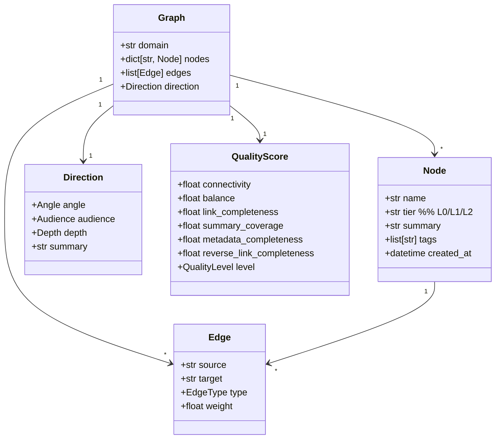

## 核心模型



## Node

```python domain/graph/models.py
class Node(BaseModel):
    name: str                          # 节点名（领域内唯一）
    tier: Literal["L0", "L1", "L2", "L3"]
    summary: str                       # 一句话定义（≤80 字）
    tags: list[str] = []               # 检索标签
    parent: str | None = None          # 父节点名（指向更高 tier）
    created_at: datetime
    updated_at: datetime
```

**不变量**：
- 名称在同一 `domain` 内唯一
- `parent` 必须指向同一 `domain` 内已存在的 Node
- 不允许成环（parent 链是树）

## Tier 分层

| Tier | 含义 | 来源 |
| --- | --- | --- |
| **L0** | 领域主题本身 | 用户输入或 L0 推断 |
| **L1** | 一级子主题（核心概念） | 5 阶段流水线第 3 阶段生成 |
| **L2** | 二级子主题（具体技术 / 论文 / 实体） | 同上 |
| **L3** | 三级（极少用） | 手动添加或 SubAgent 生成 |

**装饰**：`domain/graph/decorator.py::decorate_graph()` 在响应前自动计算每个节点的 `tier`。

## Direction

```python
class Angle(Enum):
    TECHNOLOGY = "technology"
    APPLICATION = "application"
    THEORY = "theory"
    # ...

class Audience(Enum):
    BEGINNER = "beginner"
    INTERMEDIATE = "intermediate"
    EXPERT = "expert"

class Depth(Enum):
    OVERVIEW = "overview"
    DETAILED = "detailed"
    COMPREHENSIVE = "comprehensive"

class Direction(BaseModel):
    angle: Angle
    audience: Audience
    depth: Depth
    summary: str
```

**作用**：让 5 阶段流水线能根据不同角度 / 受众 / 深度生成不同风格的图谱。

例：
```bash
kg-engine generate "RAG" --direction-hint=technology,expert,comprehensive
```

## QualityScore

6 维度评分，每维 0-1：

| 维度 | 计算 | 优化手段 |
| --- | --- | --- |
| **connectivity** | 连通子图占比 | 补全孤立节点 |
| **balance** | 子树节点数标准差倒数 | 重新规划子树边界 |
| **link_completeness** | 已声明边 / 应有边 | `fix-links` 自动补反向 |
| **summary_coverage** | 有 summary 的节点占比 | LLM 批量生成 |
| **metadata_completeness** | 必填字段填充率 | UI 提示补全 |
| **reverse_link_completeness** | 反向边占比 | 同 link_completeness |

汇总为 `QualityLevel`：

| 分数 | Level |
| --- | --- |
| ≥ 0.85 | excellent |
| ≥ 0.70 | good |
| ≥ 0.50 | fair |
| < 0.50 | poor |

## 关联图（Association Layer）

`Graph` 是节点 + 树形 parent 边；`AssociationGraph` 是**额外的语义层**——

| 关系类型 | 含义 | 例子 |
| --- | --- | --- |
| `PART_OF` | 概念归属 | "ColBERT" PART_OF "后期交互" |
| `PREREQUISITE_OF` | 前置知识 | "BM25" PREREQUISITE_OF "稀疏检索" |
| `SIMILAR_TO` | 相似 | "ColBERT" SIMILAR_TO "BERT" |
| `CONTRASTS_WITH` | 对比 | "稠密检索" CONTRASTS_WITH "稀疏检索" |
| `EXAMPLE_OF` | 实例 | "ColBERTv2" EXAMPLE_OF "ColBERT" |

**存储**：FalkorDB 主存 + `associations.json` 备份。详见 [FalkorDB 集成](/integrations/falkordb)。

## 数据落盘

图谱主要存文件系统：

```
workspace/knowledge_bases/&lt;domain&gt;/
├── knowledge_graph.json              # Graph + nodes + edges（权威源）
├── notes/
│   └── &lt;node_name&gt;.md      # 每个节点的笔记（Markdown）
├── resources/
│   └── &lt;node_name&gt;/
│       ├── web.json
│       └── uploads/
├── plans/
│   └── &lt;node_name&gt;/
│       └── plans.json
├── dossiers/
│   └── &lt;node_name&gt;.json
└── associations.json       # 语义关联（FalkorDB 故障时降级读）
```

**双源同步**：`GraphSyncOrchestrator` 监听 `knowledge_graph.json` 变更 → 写入 FalkorDB + Embedding 索引。

## 下一步

<CardGroup cols={2}>
  <Card title="关联图数据模型" icon="share-nodes" href="/concepts/association-model">
    Association / ConceptNode / ResourceNode
  </Card>
  <Card title="5 阶段生成流水线" icon="gears" href="/guides/generation-pipeline">
    怎么产出 L0/L1/L2 节点
  </Card>
  <Card title="FalkorDB 集成" icon="database" href="/integrations/falkordb">
    图存储怎么工作、降级策略
  </Card>
</CardGroup>
