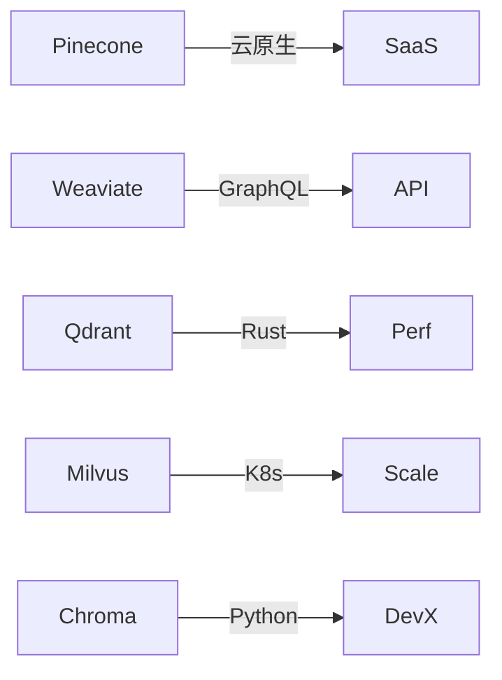

## 场景

> "我要选一个向量数据库。Pinecone / Weaviate / Qdrant / Milvus / Chroma 各有什么优劣？"

## 流程

### 第 1 步：建领域

```bash
kg-engine generate "向量数据库选型 2026" --wait
```

### 第 2 步：让 Agent 帮你搜集资料

```text
帮我搜索 2024-2026 年关于向量数据库的对比文章，添加 5-8 篇最有价值的资源
```

Agent 会：
1. 调 `kg_bocha_web_search` 搜中文资料
2. 调 `kg_search_resources` 找已有资源
3. 调 `kg_add_learning_resources` 批量添加
4. 每篇资源自动抽取元数据 + 标签

### 第 3 步：建节点骨架

```text
为每个向量数据库建一个 L1 节点：Pinecone / Weaviate / Qdrant / Milvus / Chroma
每个下面建 L2 子节点：架构 / 性能 / 部署 / 成本 / 生态
```

### 第 4 步：让 Agent 横评

```text
基于已有资源，写一份横评报告，比较这 5 个向量数据库：
1. 性能（百万 / 亿级向量）
2. 部署复杂度（自托管 vs 云托管）
3. 成本模型
4. 生态成熟度
5. 适用场景

每维度给个 1-5 分 + 一句话说明
```

Agent 会调 `kg_view_graph` + `kg_global_search` + 自己的知识，生成对比表。

### 第 5 步：可视化

切换到 **Associations** 视图：



直观看出每个产品的核心特性。

### 第 6 步：决策矩阵

用学习计划（Plans）跟踪决策过程：

```text
帮我建一个决策计划：
- Action 1: 读 Pinecone 官方 benchmark
- Action 2: 读 Milvus 官方文档
- Action 3: 在 Qdrant 上跑百万向量 POC
- Action 4: 评估成本（5 个产品 × 3 年 TCO）
- Action 5: 写决策报告
```

每个 Action 可以关联到对应节点 / 资源。完成后 Agent 自动沉淀到 Dossier。

### 第 7 步：决策

切换到 Outline 视图 → 复制 Mermaid → 贴进你的 PRD / 决策文档。

## 数据落盘与复用

整个调研过程留痕：

```
workspace/knowledge_bases/向量数据库选型/
├── knowledge_graph.json              # 5 个产品 + 子节点
├── notes/                  # 横评笔记
├── resources/各产品/        # 所有搜集到的资料
├── plans/_domain/          # 决策计划
└── dossiers/各节点.json    # 调研心得
```

3 个月后回头看，所有决策依据还在。

## 团队评审

多人协作：

1. 部署到团队服务器（参见 [生产部署](/deployment/production)）
2. 每人独立 session_id
3. 通过"@提及"或 ActivityBus 通知：
   ```bash
   curl http://localhost:8888/api/timeline/向量数据库选型?actor=user-2
   ```
4. 评论可以追加到节点笔记：
   ```bash
   curl -X PUT http://localhost:8888/api/notes/向量数据库选型?node=Pinecone \
     -H "Content-Type: text/markdown" \
     -d "# Pinecone

   ## 团队评审
   - @张三: 性能 OK 但成本太高
   - @李四: 接口最友好
   "
   ```

## 与传统 Notion 对比

| 维度 | Notion | BoundlessKG |
| --- | --- | --- |
| 结构 | 自由 | 树形 + 关联图 |
| 检索 | Ctrl+F / 数据库查询 | BM25 + 向量混合 + 图遍历 |
| 关联 | 手动 @提及 | 自动抽取 + 手动维护 |
| 时间线 | 页面历史 | JSONL 全量事件 |
| AI 辅助 | 块级 AI | Agent + 53 工具 |
| 离线 | 弱 | 强（本地文件系统） |

## 下一步

<CardGroup cols={2}>
  <Card title="学术综述图谱" icon="graduation-cap" href="/cookbook/academic">
    论文脉络管理
  </Card>
  <Card title="技术决策图谱" icon="code-branch" href="/cookbook/tech-decision">
    候选方案横评
  </Card>
</CardGroup>
