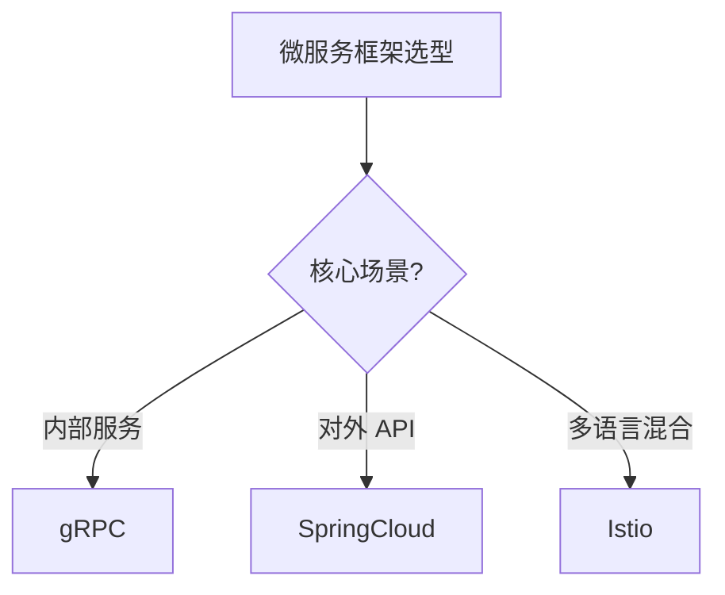

## 场景

> "我们要把单体应用拆成微服务。Spring Cloud / Dubbo / gRPC / Service Mesh（Istio / Linkerd），该选哪个？"

## 流程

### 第 1 步：建领域 + 候选节点

```bash
kg-engine generate "微服务框架选型" \
  --direction-hint=technology,expert,comprehensive \
  --wait
```

然后让 Agent 建 L1 节点：

```text
建 4 个 L1 节点：Spring Cloud / Dubbo / gRPC / Service Mesh
每个下面建 L2 子节点：性能 / 学习曲线 / 生态 / 部署 / 调试 / 团队匹配度
```

### 第 2 步：搜集资料

```text
搜索 2024-2026 年关于这 4 个框架的对比文章 / 案例研究 / 性能 benchmark
```

Agent 自动添加 10+ 资源到对应节点。

### 第 3 步：让 Agent 做横评

```text
基于已有资料，写一份横评，覆盖：
1. 性能（QPS / 延迟 / 资源占用）
2. 团队学习曲线（基于我们团队 Spring 背景）
3. 生态成熟度（监控 / 追踪 / 服务发现）
4. 部署复杂度（K8s / 物理机 / 边缘）
5. 调试友好度（本地开发 / 链路追踪）
6. 长期维护成本

每个维度给 1-5 分 + 一句话依据
```

### 第 4 步：决策评分模型

写一个 dossier 记录评分逻辑：

```text
帮我加一个 dossier 条目（pattern 类型）：
"选型应优先考虑团队当前技术栈匹配度 + 生态成熟度，性能放在第二位。
  不要选最新最热的，除非团队有时间投入学习。"
```

### 第 5 步：跑 POC

每个候选建一个 plan：

```text
帮我建 4 个 POC 计划：
- Plan 1: Spring Cloud POC（基础服务发现 + 配置中心）
- Plan 2: gRPC POC（性能 benchmark）
- Plan 3: Dubbo POC（迁移成本评估）
- Plan 4: Istio POC（实际链路追踪）

每个 Plan 含 3-5 个 Action
```

### 第 6 步：记录 POC 结果

POC 完成后，把结果写进对应节点的笔记 / dossier：

```bash
curl -X PUT http://localhost:8888/api/notes/微服务框架选型?node=gRPC \
  -H "Content-Type: text/markdown" \
  -d "# gRPC

  ## POC 结果（2026-08-28）
  - QPS: 12 万（同等条件下 Spring Cloud REST 8 万）
  - 内存占用: 60%（Spring Cloud 100%）
  - 团队上手时间: 2 周

  ## 结论
  性能优势明显，但调试工具链不成熟，建议作为内部服务通信，
  对外仍走 REST
  "
```

### 第 7 步：决策

切换到 Outline 视图，得到 Mermaid 大纲：



写进 ADR（架构决策记录）：

```markdown
# ADR-007: 微服务框架选型

## 状态
已决策 (2026-08-28)

## 上下文
团队从单体应用迁移到微服务，需要选择核心通信框架。

## 决策
- 内部服务：gRPC（性能 + 资源占用）
- 对外 API：Spring Cloud Gateway（生态成熟）
- 服务网格：暂不上，等规模扩大

## 后果
- 团队需要学 gRPC + Protobuf
- 调试工具链需补充
- 性能预期：提升 30-50%

## 依据
详见 BoundlessKG 领域 "微服务框架选型"（此处粘贴你的文档地址）。

所有评分、POC 数据、讨论记录均留痕可查。
```

## 与传统 PPT 对比

| 维度 | PPT | BoundlessKG |
| --- | --- | --- |
| 数据 | 静态 | 持续更新 |
| 依据 | 隐含 | 全部留痕（节点 + 笔记 + dossier + plan） |
| 追溯 | 会议纪要 | 时间线 + JSONL |
| 复用 | 重新做 | 永久沉淀，下次选型可参考 |

## 决策可追溯

3 年后回看："为什么当时选 gRPC？"

```bash
# 看决策当时的事件
curl 'http://localhost:8888/api/timeline/微服务框架选型?date=2026-08-28&type=PIPELINE_COMPLETED'

# 看决策时的笔记
curl 'http://localhost:8888/api/notes/微服务框架选型?node=gRPC'
```

**完整决策链路** 永久可查。

## 下一步

<CardGroup cols={2}>
  <Card title="学术综述图谱" icon="graduation-cap" href="/cookbook/academic">
    论文脉络
  </Card>
  <Card title="产品调研图谱" icon="briefcase" href="/cookbook/product">
    竞品对比
  </Card>
  <Card title="多领域适配" icon="shapes" href="/cookbook/multi-domain">
    DomainPack 抽象
  </Card>
</CardGroup>
