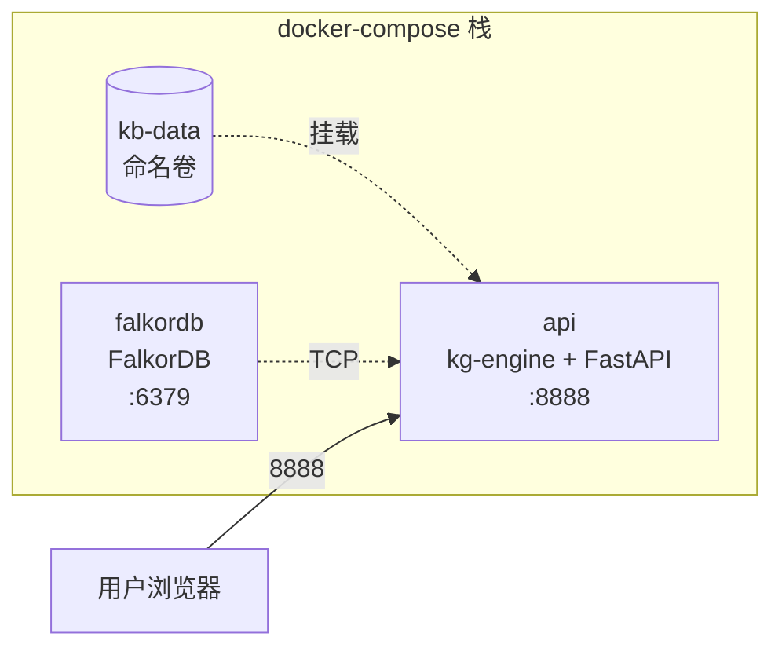

## 架构



`docker-compose.yml` 起两个服务：
- `api` —— 后端（同时托管前端静态文件）
- `falkordb` —— 图数据库（独立容器）
- 持久化卷 `kb-data` —— 知识库 + 工作区

## 构建步骤

### 1. 构建前端

```bash
cd frontend-vue && npm run build && cd ..
```

产物：`frontend-vue/dist/`

### 2. 复制 `.env`

```bash
cp .env.example .env
# 填入至少一个 LLM 密钥
```

### 3. 启动

```bash
docker compose up -d --build
```

### 4. 验证

```bash
# 健康检查
curl http://localhost:8888/api/health

# 看日志
docker compose logs -f api

# 看 FalkorDB 状态
docker compose exec falkordb redis-cli ping
# → PONG
```

## Dockerfile 关键设计

多阶段构建：

```dockerfile
# 阶段 1：前端构建
FROM node:20-alpine AS frontend
WORKDIR /app/frontend
COPY frontend-vue/package*.json ./
RUN npm ci
COPY frontend-vue/ ./
RUN npm run build
# → /app/frontend/dist

# 阶段 2：后端 + 前端整合
FROM python:3.12-slim
WORKDIR /app
COPY pyproject.toml ./
RUN pip install --no-cache-dir -e ".[deepagents]"
COPY src/ ./src/
COPY --from=frontend /app/frontend/dist ./src/api/static/
# → 启动时 FastAPI 通过 StaticFiles 挂载 /app/src/api/static
EXPOSE 8888
CMD ["kg-engine", "serve"]
```

## docker-compose.yml 关键配置

```yaml
services:
  api:
    build: .
    ports:
      - "8888:8888"
    volumes:
      - kb-data:/app/workspace
    environment:
      KG_FALKORDB_HOST: falkordb
      KG_FALKORDB_PORT: 6379
      KG_KB_ROOT: /app/workspace/knowledge_bases
      KG_WORKSPACE_DIR: /app/workspace
    depends_on:
      falkordb:
        condition: service_healthy

  falkordb:
    image: falkordb/falkordb:latest
    ports:
      - "6379:6379"  # 可选：暴露给本地调试
    volumes:
      - falkordb-data:/data
    healthcheck:
      test: ["CMD", "redis-cli", "ping"]
      interval: 5s
      timeout: 3s
      retries: 5

volumes:
  kb-data:
  falkordb-data:
```

## 数据持久化

| 卷 | 内容 | 重要性 |
| --- | --- | --- |
| `kb-data` | `workspace/` 全量（知识库 + 运行时） | **生产关键** |
| `falkordb-data` | FalkorDB 数据文件 | 重要（可从 knowledge_bases 重建） |

**备份策略**：

```bash
# 备份
docker run --rm -v boundless_kg_kb-data:/data -v $(pwd):/backup \
  alpine tar czf /backup/kb-data-$(date +%F).tar.gz -C /data .

# 恢复
docker run --rm -v boundless_kg_kb-data:/data -v $(pwd):/backup \
  alpine tar xzf /backup/kb-data-*.tar.gz -C /data
```

## 镜像源加速（国内）

Docker Desktop on Windows / Mac 配置镜像加速：

```json ~/.docker/daemon.json
{
  "registry-mirrors": [
    "https://docker.mirrors.ustc.edu.cn",
    "https://hub-mirror.c.163.com",
    "https://mirror.baidubce.com"
  ]
}
```

重启 Docker Desktop 生效。

## 故障排查

| 症状 | 排查 |
| --- | --- |
| `api` 启动后立即退出 | `docker compose logs api`；大概率 `.env` 缺 LLM key |
| FalkorDB 连接失败 | `docker compose exec falkordb redis-cli ping`；检查 `depends_on` |
| 前端 404 | 忘了 `npm run build`；或 `dist/` 路径不对 |
| 知识库数据丢失 | `kb-data` 卷没挂载；`docker volume ls` 检查 |
| API 慢 | FalkorDB 数据全在内存，小数据集（&lt;10w 节点）通常足够 |

## 下一步

<CardGroup cols={2}>
  <Card title="WSL2 安装" icon="terminal" href="/deployment/wsl2">
    Windows 开发环境
  </Card>
  <Card title="生产部署" icon="server" href="/deployment/production">
    多副本 / 反向代理 / 备份
  </Card>
  <Card title="环境变量全集" icon="list" href="/deployment/env-vars">
    所有配置项
  </Card>
</CardGroup>
