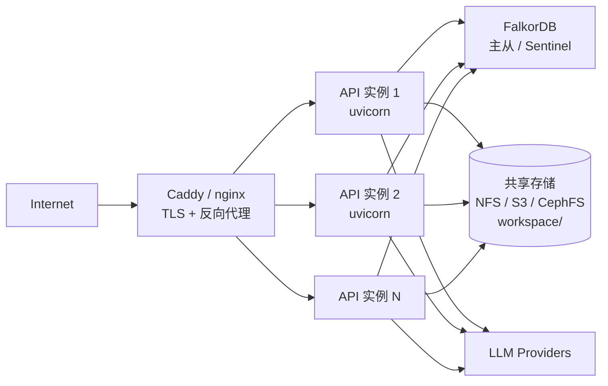

## 架构



⚠️ **多副本需要共享存储**（因为 `workspace/` 是文件系统）。最简单的方案是 NFS，复杂场景用 S3 + FUSE。

## 反向代理（nginx 示例）

```nginx /etc/nginx/sites-available/boundless-kg
upstream kg_api {
    server api1.internal:8888;
    server api2.internal:8888;
    server api3.internal:8888;
    keepalive 32;
}

server {
    listen 443 ssl http2;
    server_name docs.yourdomain.com;

    ssl_certificate     /etc/letsencrypt/live/docs.yourdomain.com/fullchain.pem;
    ssl_certificate_key /etc/letsencrypt/live/docs.yourdomain.com/privkey.pem;

    client_max_body_size 200M;  # 文件上传

    location / {
        proxy_pass http://kg_api;
        proxy_set_header Host $host;
        proxy_set_header X-Real-IP $remote_addr;
        proxy_set_header X-Forwarded-For $proxy_add_x_forwarded_for;
        proxy_set_header X-Forwarded-Proto $scheme;
    }

    # SSE 必须关闭缓冲
    location /api/agent/invoke {
        proxy_pass http://kg_api;
        proxy_buffering off;
        proxy_cache off;
        proxy_set_header Connection '';
        proxy_http_version 1.1;
        chunked_transfer_encoding off;
    }

    # 静态文件可走 CDN
    location /static/ {
        alias /var/www/boundless-kg/static/;
        expires 30d;
    }
}
```

**关键**：`/api/agent/invoke` 必须 `proxy_buffering off`，否则 SSE 流被缓冲成一次返回。

## TLS

Caddy 自动 Let's Encrypt；nginx 用 certbot：

```bash
sudo certbot --nginx -d docs.yourdomain.com
```

## 多副本 + 共享存储

### 选项 A：NFS

```bash
# nfs-server
echo "/srv/boundless-kg *(rw,sync,no_subtree_check)" >> /etc/exports
exportfs -a

# api 容器挂载
volumes:
  - nfs:/app/workspace
```

### 选项 B：S3 + FUSE（s3fs）

适合云原生。

### 选项 C：分布式文件系统（CephFS / GlusterFS）

适合大规模生产。

**⚠️ 警告**：本地磁盘多副本**不可行**——`workspace/_pipeline/state.json` 状态会被多个 API 实例同时改写。

## FalkorDB 高可用

### 选项 A：单实例 + 备份

最简单。`docker run` + 定期 `BGSAVE`：

```bash
docker exec falkordb redis-cli BGSAVE
docker cp falkordb:/data/dump.rdb /backup/
```

### 选项 B：Sentinel（主从 + 自动故障转移）

```yaml
services:
  falkordb-master:
    image: falkordb/falkordb:latest
    ports: ["6379"]
  
  falkordb-replica:
    image: falkordb/falkordb:latest
    command: redis-server --replicaof falkordb-master 6379
    depends_on: [falkordb-master]
  
  falkordb-sentinel:
    image: falkordb/falkordb:latest
    command: redis-sentinel /etc/sentinel.conf
    depends_on: [falkordb-master, falkordb-replica]
```

应用层连 sentinel（`redissentinel://...`）。当前 falkordb-py 客户端**尚未完全支持** sentinel，需要用 `redis-py` 直接连。

### 选项 C：FalkorDB Cloud

官方托管服务。

## 备份策略

### 知识库（关键）

```bash
# 每日全量
0 2 * * * tar czf /backup/kb-$(date +\%F).tar.gz /srv/boundless-kg/knowledge_bases/

# 保留 30 天
find /backup -name "kb-*.tar.gz" -mtime +30 -delete
```

### FalkorDB（次要，可重建）

```bash
0 3 * * * docker exec falkordb redis-cli BGSAVE && \
  docker cp falkordb:/data/dump.rdb /backup/falkordb-$(date +\%F).rdb
```

**关键事实**：FalkorDB 数据可从 `knowledge_bases/` 重建，丢失只是性能问题，**不是数据问题**。

### 会话记忆（可选）

```bash
0 4 * * * tar czf /backup/memory-$(date +\%F).tar.gz /srv/boundless-kg/.agent_memory/
```

## 监控

### 健康检查

```bash
curl -fs http://localhost:8888/api/health | jq .
```

预期：

```json
{
  "status": "ok",
  "agent_build_status": "ready",
  "falkordb_healthy": true,
  "uptime_sec": 12345
}
```

### Prometheus 集成

`/api/health` 可加 Prometheus 格式（v1.1 计划）：

```
# HELP kg_up Whether the API is up
# TYPE kg_up gauge
kg_up 1

# HELP kg_falkordb_healthy Whether FalkorDB is reachable
# TYPE kg_falkordb_healthy gauge
kg_falkordb_healthy 1

# HELP kg_agent_build_status Agent build state (0=building, 1=ready, 2=failed)
# TYPE kg_agent_build_status gauge
kg_agent_build_status 1
```

详见 [监控与日志](/deployment/monitoring)。

### 告警

| 指标 | 阈值 |
| --- | --- |
| `kg_up = 0` | 立即 |
| `kg_falkordb_healthy = 0` | 5 min 后 |
| `kg_agent_build_status = 0` | 10 min 后 |
| `/api/timeline` 中 `PIPELINE_FAILED` 频繁 | 1h 内 ≥3 次 |
| 磁盘空间 | &lt;10% |

## 安全清单

- [ ] TLS（certbot / Caddy）
- [ ] CORS 白名单（`KG_API_CORS_ORIGINS`）
- [ ] 容器不暴露公网端口（仅 nginx 暴露 443）
- [ ] `.env` 不进 git（已在 `.gitignore`）
- [ ] FalkorDB 启用密码（`KG_FALKORDB_PASSWORD`）
- [ ] `KG_AGENT_SHELL_ENABLED=false`（如果 Agent 不需要 shell）
- [ ] API Key 限流（nginx `limit_req_zone`）
- [ ] 定期安全更新镜像：`docker compose pull && docker compose up -d`

## 滚动升级

```bash
# 1. 拉新镜像
docker compose pull

# 2. 逐个替换
docker compose up -d --no-deps api1
docker compose up -d --no-deps api2
docker compose up -d --no-deps api3
```

**注意**：升级前看 [Changelog](/changelog) 是否需要数据迁移。

## 下一步

<CardGroup cols={2}>
  <Card title="Docker 部署" icon="docker" href="/deployment/docker">
    单机部署
  </Card>
  <Card title="监控与日志" icon="chart-line" href="/deployment/monitoring">
    可观测性
  </Card>
</CardGroup>
