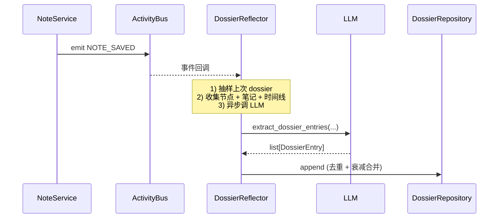

## 为什么需要 Dossier

笔记是"客观事实"，档案是"踩过的坑"。同样的节点：

- 笔记会写 "ColBERT 适合中等规模语料库"
- 档案会写 "在 50 万文档量级、英文为主时跑过，召回比单塔高 12%；中文场景下需要额外分词处理"

档案是**策展人的经验沉淀**，对未来做相似决策有用。

## 数据模型

```python
class DossierEntryType(str, Enum):
    GOTCHA = "gotcha"               # 踩坑
    INSIGHT = "insight"             # 洞察
    PATTERN = "pattern"             # 模式
    REMINDER = "reminder"           # 提醒
    EXTERNAL_REF = "external_ref"   # 外部引用

class DossierEntry(BaseModel):
    id: str
    type: DossierEntryType
    content: str
    weight: float                   # 0-1，重要性
    decay: float                    # 时间衰减系数（默认 0.95/月）
    created_at: datetime
    last_referenced_at: datetime
    reference_count: int

class Dossier(BaseModel):
    domain: str
    node: str
    entries: list[DossierEntry]
```

## 存储

```text
workspace/knowledge_bases/&lt;domain&gt;/dossiers/&lt;node&gt;.json
```

## 写入流程（异步）



**关键设计**：
- **Fire-and-forget**：用户保存笔记不阻塞，dossier 异步更新
- **时间衰减**：旧条目 weight 随时间衰减（`weight *= 0.95^(months_elapsed)`）
- **去重**：相同内容（jaccard > 0.8）合并到原条目，reference_count++

## API

### Dossier 读

```http
GET  /api/.../dossiers/{domain}?node=ColBERT
```

（注：当前主要通过 Agent 工具访问，HTTP 直读接口为 v1.1 计划）

### Agent 工具

```python
@tool
async def kg_add_dossier_entry(domain: str, node: str, entry_type: str, content: str, weight: float = 0.7) -> str:
    """手动添加档案条目（通常是 Agent 在对话中识别到"经验"时调用）。"""

@tool
async def kg_view_dossier(domain: str, node: str, *, include_decayed: bool = False) -> str:
    """查看节点档案。可选包含已衰减的条目。"""

@tool
async def kg_search_dossier(domain: str, query: str, *, top_k: int = 5) -> str:
    """跨节点档案检索（用向量相似度）。"""

@tool
async def kg_update_dossier_entry(domain: str, node: str, entry_id: str, **fields) -> str:
    """更新条目（通常是 Agent 根据新信息调整 weight）。"""

@tool
async def kg_remove_dossier_entry(domain: str, node: str, entry_id: str) -> str:
    """删除条目。"""
```

## 时间衰减公式

```python
def current_weight(entry: DossierEntry, now: datetime) -> float:
    months = (now - entry.last_referenced_at).days / 30
    decayed = entry.weight * (0.95 ** months)
    # 引用次数加成（每引用一次 +5%，上限 1.0）
    bumped = min(1.0, decayed * (1 + 0.05 * entry.reference_count))
    return bumped
```

**含义**：6 个月没引用的 entry weight 自动降 ~26%；被多次引用的 entry 即使旧也不会衰减太多。

## Agent 怎么用档案

典型 prompt 注入场景（v1.1 计划，尚未实现）：

```text
当前节点 "ColBERT" 的相关档案（按权重排序）：
1. [INSIGHT, weight=0.92] 在 50 万文档量级、英文为主时，召回比单塔高 12%
2. [GOTCHA, weight=0.81] 中文场景下需要额外分词处理，否则 token 化失败
3. [PATTERN, weight=0.65] 与 BERT 的区别在"后期交互"环节

请基于以上经验回答用户问题。
```

## 配置

`KG_AGENT_DOSSIER_ENABLED` (v1.1 计划，尚未实现) 控制是否启用 dossier 注入。

## 下一步

<CardGroup cols={2}>
  <Card title="提示词卡片" icon="note-sticky" href="/guides/cards">
    与 dossier 类似的动态注入机制
  </Card>
  <Card title="事件总线" icon="timeline" href="/concepts/event-bus">
    dossier 怎么被异步触发
  </Card>
</CardGroup>
