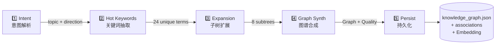

## 概览



**入口**：`src/application/generation_pipeline.py::GenerationPipeline`
**触发方式**：
- CLI：`kg-engine generate "&lt;topic&gt;" --wait`
- API：`kg_run_skill` 工具
- 前端：聊天框"帮我创建 ..."

## 阶段 1：Intent（意图解析）

**目的**：判断主题的方向（角度 / 受众 / 深度），让后续生成更有针对性。

**实现**：`src/domain/intent/parser.py`

```python
# 三采样投票：跑 3 次相同 prompt，取众数
async def parse_intent(topic: str, hint: Direction | None = None) -> Intent:
    samples = await asyncio.gather(*[
        llm.chat_structured(messages, schema=Intent)
        for _ in range(3)
    ])
    return majority_vote(samples)
```

**输出**：`{angle, audience, depth, confidence, reasoning}`

**为什么三采样？** 单次 LLM 调用对"模糊主题"分类不稳。三采样 + 投票把准确率从 ~70% 拉到 ~90%。代价是 3x LLM 调用，但通常几秒就完成。

## 阶段 2：Hot Keywords（关键词抽取）

**目的**：从主题 + 意图出发，列出 20-30 个高价值关键词，作为子树扩展的种子。

**实现**：`src/domain/hot_keyword/extractor.py`

```python
async def extract_keywords_async(topic: str, intent: Intent) -> list[Keyword]:
    raw = await llm.chat_structured(messages, schema=list[Keyword])
    return jaccard_dedup(raw, threshold=0.6)  # src/domain/hot_keyword/dedup.py
```

**输出**：`[{term, weight, search_query}]`

**Jaccard 去重**：避免 "RAG" 和 "Retrieval-Augmented Generation" 被当成两个词。

## 阶段 3：Expansion（子树扩展）

**目的**：把关键词分成 6-10 组，每组展开成一个 L2 子树。

**实现**：`src/domain/hot_keyword/query_builder.py` + 多次 LLM 调用

```python
async def expand(theme: str, keywords: list[Keyword]) -> list[Subtree]:
    groups = cluster_keywords(keywords, k=8)  # k-means on embeddings
    subtrees = await asyncio.gather(*[
        expand_one_subtree(theme, group) for group in groups
    ])
    return subtrees
```

**输出**：`[{name, summary, tier="L1", children: [Node]}]`

**并发控制**：`KG_SEARCH_MAX_CONCURRENCY` 限制同时跑的 LLM 数。

## 阶段 4：Graph Synth（图谱合成）

**目的**：把子树们合成一张完整的图谱：补反向链接、计算 tier、算 6 维质量分。

**实现**：`src/domain/graph/decorator.py::decorate_graph()` + `validator.py::validate()`

```python
graph = assemble(subtrees)              # 合并 + 命名冲突消解
graph = link_fixer.fix(graph)            # 补反向链接
graph = decorator.decorate(graph)        # 计算 tier / L0 根
score = validator.validate(graph)        # 6 维评分
```

**质量门**：`score.level >= QualityLevel.FAIR` 才进入下一阶段；否则把问题节点打回阶段 3 重试（最多 2 次）。

## 阶段 5：Persist（持久化）

**目的**：把图谱落到文件系统 + FalkorDB + Embedding 索引。

```python
# application/generation_pipeline.py
await graph_repo.save(graph)                   # knowledge_graph.json（原子写）
await graph_sync_orchestrator.full_sync(graph) # FalkorDB + Embedding
await activity_bus.emit(ActivityEvent(
    event_type="PIPELINE_COMPLETED",
    payload={"node_count": len(graph.nodes), "quality": score.level},
))
```

**原子写**：`src/infrastructure/repository/_atomic.py` 先写 `&lt;file&gt;.tmp` 再 `os.replace()`。

## 状态持久化与可恢复性

`src/infrastructure/pipeline_state_store.py` 把每阶段的状态写到 `_pipeline/&lt;task_id&gt;/state.json`：

```json
{
  "task_id": "gen-2026-08-28-xxx",
  "topic": "RAG",
  "current_stage": "expansion",
  "stages": {
    "intent": {"status": "done", "result": {...}},
    "keywords": {"status": "done", "result": {...}},
    "expansion": {"status": "running", "progress": "5/8"},
    "graph_synth": {"status": "pending"},
    "persist": {"status": "pending"}
  }
}
```

**好处**：进程崩溃后重启可以从中断的阶段继续，不需要从头跑。

## 故障与重试

| 阶段 | 典型失败 | 自动处理 |
| --- | --- | --- |
| Intent | LLM 返回非法 JSON | `kg_repair_json` 兜底 |
| Keywords | 关键词全是停用词 | 触发回退到 Bocha 搜索 |
| Expansion | LLM 超时 | 单子树失败不影响其他，失败子树标记为 `failed` 继续 |
| Graph Synth | 反向链接成环 | `link_fixer` 检测并打破环 |
| Persist | FalkorDB 不可达 | 降级到只写 `knowledge_graph.json` + `associations.json` |

## CLI 调优

```bash
# 完整跑
kg-engine generate "RAG" --wait

# 给方向提示
kg-engine generate "RAG" --direction-hint=technology,expert,comprehensive

# 不阻塞
kg-engine generate "RAG"  # 立即返回 task_id
# 然后：
kg-engine associations stats &lt;domain&gt;  # 或通过 API 查进度
```

## 下一步

<CardGroup cols={2}>
  <Card title="笔记生成" icon="note-sticky" href="/guides/notes">
    NoteService + NoteGenerator
  </Card>
  <Card title="提示词卡片" icon="cards-blank" href="/guides/cards">
    行为规范怎么注入
  </Card>
  <Card title="节点档案" icon="user-secret" href="/guides/dossiers">
    异步经验沉淀
  </Card>
</CardGroup>
