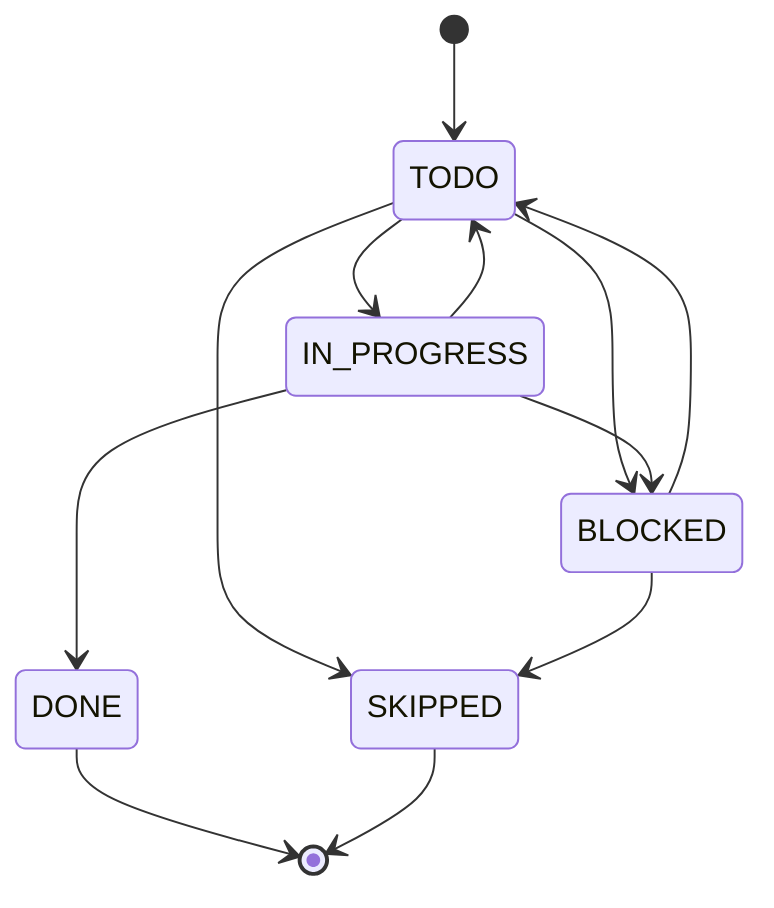

## 数据模型

```python
class ActionStatus(str, Enum):
    TODO = "todo"
    IN_PROGRESS = "in_progress"
    DONE = "done"
    BLOCKED = "blocked"
    SKIPPED = "skipped"

class Action(BaseModel):
    id: str
    title: str
    description: str | None
    status: ActionStatus
    order: int
    created_at: datetime
    updated_at: datetime
    completed_at: datetime | None

class Plan(BaseModel):
    id: str
    domain: str
    node: str | None                # None = 领域级计划
    title: str
    description: str | None
    actions: list[Action]
    status: Literal["active", "completed", "archived"]
    created_at: datetime
    updated_at: datetime
```

## 存储

```text
workspace/knowledge_bases/&lt;domain&gt;/plans/&lt;node&gt;/plans.json
# 或领域级（node 不存在）
workspace/knowledge_bases/&lt;domain&gt;/plans/_domain/plans.json
```

## API

### 列表

```http
# 节点级
GET /api/plans/{domain}?node=ColBERT

# 领域级
GET /api/plans/{domain}
```

### CRUD

```http
POST   /api/plans/{domain}                        {node, title, description, actions: [...]}
PUT    /api/plans/{domain}/{node}/{plan_id}       {title?, description?, status?}
DELETE /api/plans/{domain}/{node}/{plan_id}

# Action 状态更新
PUT    /api/plans/{domain}/{node}/{plan_id}/actions/{aid}    {status, title?, description?}
DELETE /api/plans/{domain}/{node}/{plan_id}/actions/{aid}
```

## Action 状态机



**Plan 完成判定**：`recompute_plan_status(plan)` —— 当所有 `action.status in (DONE, SKIPPED)` 时，plan.status 自动从 `active` 变 `completed`。

## 实现

### PlanService

`src/application/plan_service.py`：

```python
class PlanService:
    async def add_plan(self, domain: str, node: str | None, payload: AddPlanRequest) -> Plan:
        plan = Plan(id=uuid4().hex, domain=domain, node=node, ...)
        await self.repo.write(plan)
        await activity_bus.emit(ActivityEvent(
            event_type="PLAN_ADDED", domain=domain, node=node, payload={"plan_id": plan.id}
        ))
        return plan

    async def update_action_status(self, ..., action_id: str, status: ActionStatus):
        # 更新 action + 自动 recompute plan.status
        ...
```

### PlanRepository

`src/infrastructure/repository/plan_repo.py` + `recompute_plan_status()`。

## 遗留数据迁移

`src/application/node_migration.py` 负责节点重命名/删除时迁移关联资源，**包括 plan**：

```python
async def migrate_on_rename(domain: str, old_name: str, new_name: str):
    await plan_repo.rename_node(domain, old_name, new_name)

async def migrate_on_delete(domain: str, node: str):
    await plan_repo.delete_node(domain, node)
```

## Agent 工具

```python
@tool
async def kg_add_plan(domain: str, node: str, title: str, actions: list[str]) -> str:
    """围绕节点创建学习计划。actions 是标题列表，自动分配 order。"""

@tool
async def kg_list_plans(domain: str, node: str) -> str:
    """列出节点下所有计划及其状态。"""

@tool
async def kg_update_plan_status(domain: str, node: str, plan_id: str, action_id: str, status: str) -> str:
    """更新 Action 状态。"""

@tool
async def kg_delete_plan(domain: str, node: str, plan_id: str) -> str:
    """删除计划。"""
```

## 前端

`frontend-vue/src/components/PlanDialog.vue` —— 计划编辑器

`frontend-vue/src/components/PlanActionContent.vue` —— Action 详情（笔记/资源/关联）

## 下一步

<CardGroup cols={2}>
  <Card title="资源管理" icon="paperclip" href="/guides/resources">
    资源如何与计划联动
  </Card>
  <Card title="节点档案" icon="user-secret" href="/guides/dossiers">
    Action 完成时沉淀经验
  </Card>
  <Card title="Plans API" icon="code" href="/api-reference/plans">
    完整接口列表
  </Card>
</CardGroup>
