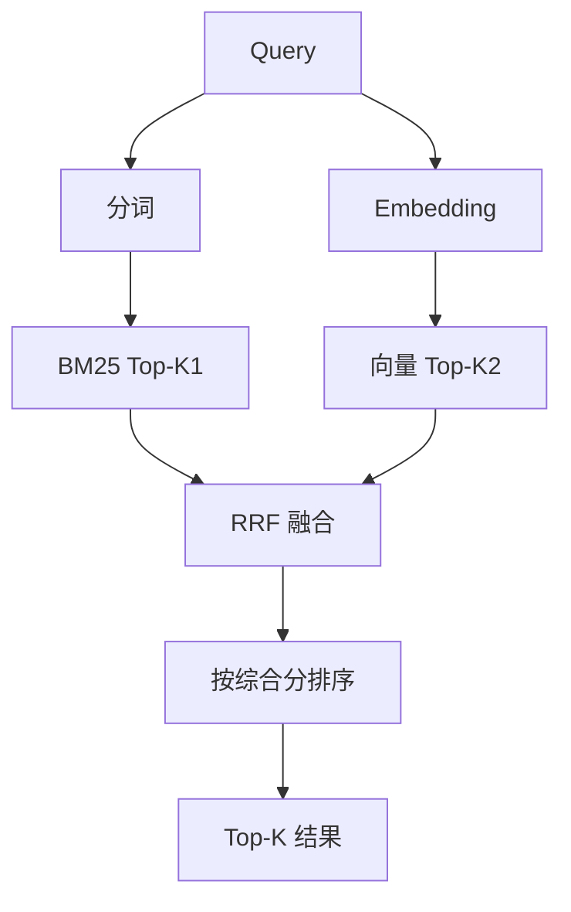
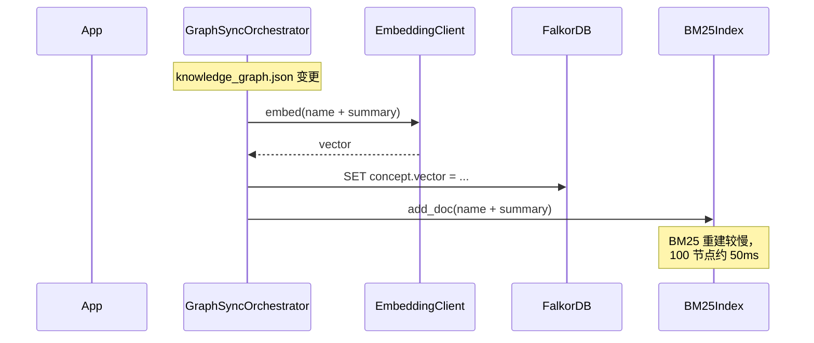

## 为什么混合

单一检索通道各有盲区：

| 通道 | 强项 | 弱项 |
| --- | --- | --- |
| **BM25** | 精确关键词命中 | 不懂语义（同义词挂） |
| **向量** | 语义相似 | 缺精确匹配（专有名词） |

BoundlessKG 把两者**倒数排名融合（RRF）**：

```text
score(d) = Σ 1 / (k + rank_i(d))    # i ∈ {bm25, vector}
k = 60                                  # RRF 常数
```

权重由 `KG_SEARCH_BM25_WEIGHT` / `KG_SEARCH_VECTOR_WEIGHT` 控制，默认 0.4 / 0.6。

## Embedding 客户端

`src/infrastructure/embedding/client.py`：

```python
class EmbeddingClient:
    async def embed(self, texts: list[str]) -> list[list[float]]:
        """批量嵌入。内部走 KG_EMBEDDING_BASE_URL + KG_EMBEDDING_MODEL。"""

    async def embed_query(self, query: str) -> list[float]:
        """单查询嵌入。"""

    async def similarity(self, a: list[float], b: list[float]) -> float:
        return cosine_similarity(a, b)
```

## 配置

```bash .env
KG_EMBEDDING_PROVIDER=api         # 当前只支持 api
KG_EMBEDDING_API_KEY=sk-...
KG_EMBEDDING_BASE_URL=https://api.deepseek.com
KG_EMBEDDING_MODEL=text-embedding-v1
KG_EMBEDDING_DIM=1024
KG_EMBEDDING_BATCH_SIZE=32

# 混合检索权重
KG_SEARCH_BM25_WEIGHT=0.4
KG_SEARCH_VECTOR_WEIGHT=0.6
KG_SEARCH_DEFAULT_TOP_K=10
```

**OpenAI 兼容**：任何支持 `/v1/embeddings` 端点的服务都可以（DeepSeek / OpenAI / 自托管）。

## BM25 索引

`src/infrastructure/embedding/bm25.py`：

```python
class BM25Index:
    def __init__(self, k1: float = 1.5, b: float = 0.75):
        self._docs: list[str] = []
        self._index: BM25Okapi | None = None

    def build(self, corpus: list[str]) -> None:
        tokenized = [_tokenize(doc) for doc in corpus]
        self._index = BM25Okapi(tokenized, k1=self.k1, b=self.b)

    def query(self, q: str, top_k: int = 10) -> list[tuple[int, float]]:
        scores = self._index.get_scores(_tokenize(q))
        return sorted(enumerate(scores), key=lambda x: -x[1])[:top_k]

def _tokenize(text: str) -> list[str]:
    """中英文混合分词：英文按空格 + 小写，中文按字符 bigram。"""
```

## 检索流程



```python
class HybridSearch:
    async def search(self, domain: str, query: str, top_k: int = 10) -> list[SearchHit]:
        bm25_hits = self.bm25_index[domain].query(query, top_k=top_k * 2)
        vec_hits = await self.embedding.similarity_search(domain, query, top_k=top_k * 2)
        return reciprocal_rank_fusion(
            bm25_hits, vec_hits,
            w_bm25=KG_SEARCH_BM25_WEIGHT,
            w_vec=KG_SEARCH_VECTOR_WEIGHT,
            k=top_k,
        )
```

## API

```http
# 全局混合检索
GET /api/search/{domain}/global?q=后期交互&top_k=10

# 邻居检索（仅 FalkorDB 图遍历）
GET /api/graph/{domain}/neighbors?node=ColBERT&depth=2

# 同步（重建索引）
POST /api/graph/{domain}/sync
POST /api/graph/{domain}/sync-node?node=ColBERT

# 统计
GET /api/graph/{domain}/statistics
```

## Agent 工具

```python
@tool
async def kg_global_search(domain: str, query: str, top_k: int = 10) -> str:
    """在领域内做 BM25 + 向量混合检索，返回相关节点 + 摘要。"""

@tool
async def kg_graph_neighbors(domain: str, node: str, depth: int = 1) -> str:
    """返回节点的 N 跳邻居（关联图遍历）。"""
```

## 索引生命周期



**增量 vs 全量**：
- 单节点变更 → 增量（向量单条更新，BM25 增量加文档）
- 大批量变更（≥10% 节点） → 全量重建

## 调优

| 场景 | 调优 |
| --- | --- |
| 关键词检索不准 | 调高 `KG_SEARCH_BM25_WEIGHT=0.6` |
| 语义匹配差 | 调高 `KG_SEARCH_VECTOR_WEIGHT=0.7` |
| 检索慢 | 调小 `top_k`，加 HNSW ef 参数 |
| 嵌入超时 | 调小 `KG_EMBEDDING_BATCH_SIZE=16` |

## 降级

如果 Embedding API 不可达：

1. 仅返回 BM25 命中（无向量通道）
2. 不报错（标 `embedding_disabled=true` 在 metadata）
3. 后台继续尝试重连

## 下一步

<CardGroup cols={2}>
  <Card title="FalkorDB 集成" icon="database" href="/integrations/falkordb">
    向量存哪里
  </Card>
  <Card title="搜索后端" icon="magnifying-glass" href="/integrations/search-backends">
    Web 搜索通道
  </Card>
</CardGroup>
