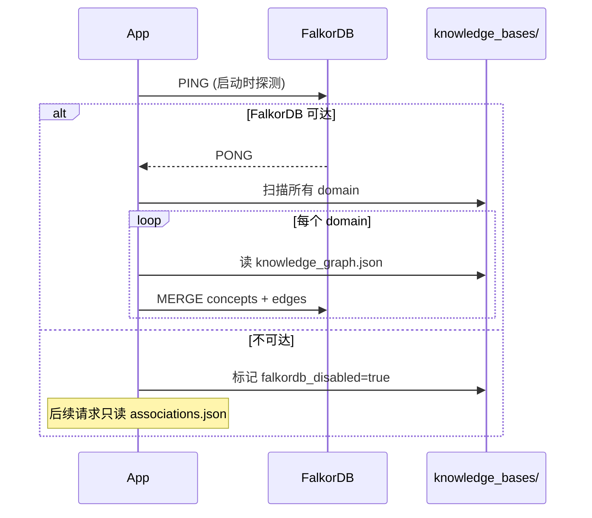
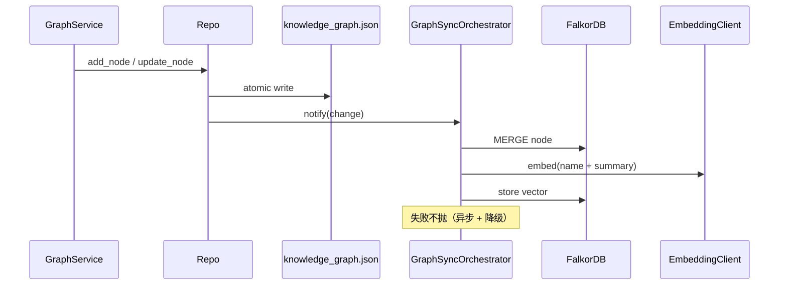

## 角色定位

FalkorDB 是 **检索加速层**，不是真相源。

- 真相源：`workspace/knowledge_bases/&lt;domain&gt;/knowledge_graph.json`（人类可读、git 友好）
- 加速层：FalkorDB（嵌入向量 + 关联图遍历）

**GraphSyncOrchestrator** 单向监听 `knowledge_graph.json` 变更 → 写入 FalkorDB。**反向同步不存在**。

## Schema

```cypher
// 概念节点
(:Concept {
  domain: STRING,
  name: STRING,
  aliases: LIST<STRING>,
  mention_count: INT
})

// 资源节点
(:Resource {
  domain: STRING,
  url: STRING,
  title: STRING,
  type: STRING,
  last_indexed_at: TIMESTAMP
})

// 关联边（带强度 + 置信度）
(:Concept)-[:ASSOCIATED {
  relation: STRING,           // PART_OF / PREREQUISITE_OF / SIMILAR_TO / ...
  strength: FLOAT,            // 0-1
  confidence: FLOAT,          // 0-1，LLM 抽取置信度
  source: STRING              // llm / manual / inferred
}]->(:Concept)

(:Concept)-[:REFERENCES]->(:Resource)
```

所有图前缀 `kg_`（`KG_FALKORDB_GRAPH_PREFIX`），便于多租户。

## 部署

### Docker

```bash
docker run -d --name falkordb \
  -p 6379:6379 \
  -v falkordb-data:/data \
  falkordb/falkordb:latest
```

### 配置文件

```bash .env
KG_FALKORDB_HOST=localhost
KG_FALKORDB_PORT=6379
KG_FALKORDB_PASSWORD=
KG_FALKORDB_GRAPH_PREFIX=kg_
KG_FALKORDB_ENABLED=true
KG_ASSOCIATIONS_SOURCE=auto    # auto / falkordb / json
```

## 数据源策略（KG_ASSOCIATIONS_SOURCE）

| 值 | 行为 |
| --- | --- |
| `auto`（默认） | FalkorDB 可达就用；不可达静默回退 `associations.json` |
| `falkordb` | 强制用 FalkorDB；失败返回空 shell（不报错） |
| `json` | 强制用 `associations.json`；便于回滚 FalkorDB |

## 启动顺序



## 同步流程



**失败不抛**：FalkorDB 写入失败不会让 API 报错，只记日志。文件树永远是真相。

## 降级触发

```python
class GraphStoreClient:
    async def health_check(self) -> bool:
        try:
            await self.fdb.ping()
            return True
        except Exception:
            self._enabled = False
            log.warning("FalkorDB unreachable, degrading to JSON")
            return False
```

降级后：

1. `/api/associations/*` 改读 `associations.json`
2. `/api/search/*` 改用纯 BM25（无向量）
3. 后台继续每 60s 尝试重连

## API

```http
GET  /api/associations/{domain}/concepts
GET  /api/associations/{domain}/resources
GET  /api/associations/{domain}/edges
GET  /api/associations/{domain}/neighbors?node=ColBERT&depth=2
GET  /api/associations/{domain}/statistics
POST /api/associations/{domain}/sync         # 手动全量同步
POST /api/associations/{domain}/sync-node    # 单节点同步
POST /api/associations/{domain}/flush-llm    # 强制 flush PendingNodesBuffer
POST /api/associations/{domain}/extract-now  # 立即触发关联抽取
POST /api/associations/{domain}/manual       # 手动添加关联
DELETE /api/associations/{domain}/manual     # 手动删除
```

## 性能

| 操作 | 复杂度 | 量级 |
| --- | --- | --- |
| 概念节点 MERGE | O(1) | ~1 ms |
| 邻居查询（depth=2） | O(deg²) | &lt;50 ms（典型图） |
| 向量相似度检索 | O(log N) via HNSW | &lt;20 ms |
| 全量同步（100 节点） | O(N) | &lt;2 s |

## 备份与恢复

```bash
# 备份（只备份 JSON，FalkorDB 可重建）
tar czf backup-$(date +%F).tar.gz workspace/knowledge_bases/

# 恢复
tar xzf backup-*.tar.gz
# 启动后会自动重新同步到 FalkorDB
```

## 下一步

<CardGroup cols={2}>
  <Card title="关联图数据模型" icon="share-nodes" href="/concepts/association-model">
    RelationType / EdgeIntensity
  </Card>
  <Card title="Embedding 混合检索" icon="magnifying-glass" href="/integrations/embedding">
    BM25 + 向量权重
  </Card>
  <Card title="生产部署" icon="server" href="/deployment/production">
    FalkorDB HA / 监控
  </Card>
</CardGroup>
