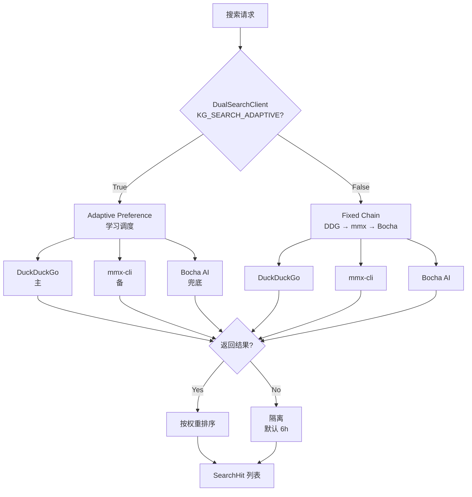

## 一图概览



## 三个后端

### DuckDuckGo（主）

```bash .env
DDG_PROXY=                 # 空 = 自动检测系统代理
# 或显式指定
DDG_PROXY=http://127.0.0.1:7897
```

**特点**：
- 默认主通道
- 不需要 API key
- 自动检测 Windows registry / env / 端口探测（`src/infrastructure/search/ddg.py::detect_proxy()`）
- 国内访问通常需要代理

### mmx-cli / MiniMax 搜索（备）

```bash .env
MMX_API_KEY=...
MMX_REGION=cn
MMX_PROXY=
```

**特点**：
- mmx 自家搜索后端
- 需要密钥

### Bocha AI（兜底，中文搜索质量最佳）

```bash .env
BOCHA_API_KEY=...
BOCHA_ENDPOINT=https://api.bochaai.com/v1/web-search
BOCHA_PROXY=
BOCHA_TIMEOUT_SEC=15
BOCHA_COUNT=10
```

**特点**：
- 付费 API
- 中文搜索质量最好
- `BOCHA_API_KEY` 为空时**静默跳过**（不报 401 噪音）

## 自适应调度

`KG_SEARCH_ADAPTIVE=true`（默认）时启用 `DualSearchClient`：

```python
class DualSearchClient:
    """根据历史成功率动态调整后端优先级 + 隔离失败后端。"""

    async def search(self, query: str) -> list[SearchHit]:
        backend_order = self.preference.get_preferred_order()
        for backend in backend_order:
            if self.preference.is_quarantined(backend):
                continue
            try:
                hits = await backend.search(query)
                self.preference.record_success(backend)
                return hits
            except Exception as e:
                self.preference.record_failure(backend, e)
                # 继续尝试下一个后端
        raise SearchAllBackendsFailed()
```

**自适应行为**：
- 成功一次 → 该后端优先级 +1
- 失败一次 → 该后端进入隔离（默认 6 小时 `KG_SEARCH_QUARANTINE_SEC`）
- 隔离期内不重试；过期后恢复
- 历史写入 `.agent_memory/search_preference.json`，ops 可 grep

## 固定链模式

`KG_SEARCH_ADAPTIVE=false` 时走 legacy 固定链：DDG → mmx → Bocha。

**适用场景**：调试、可重复性优先（不学）。

## 并发与限流

```bash .env
KG_SEARCH_MAX_CONCURRENCY=5      # 同时跑的后端数
KG_SEARCH_RATE_LIMIT_MS=300      # 单后端最小间隔
```

`RateLimitedSearchClient`（详见 [并发与限流](/guides/concurrency)）自动应用。

## Agent 工具

```python
@tool
async def kg_bocha_web_search(query: str, count: int = 10) -> str:
    """直接调 Bocha（不走自适应）。"""

@tool
async def kg_set_search_channel(channel: Literal["bocha", "ddg", "mmx", "auto"]) -> str:
    """本次会话内固定使用某个后端。"""

@tool
async def kg_clear_search_channel() -> str:
    """恢复自适应。"""
```

## 排查清单

| 症状 | 检查 |
| --- | --- |
| 所有请求都走 Bocha | DDG 失败太多被优先化，看 `search_preference.json` |
| Bocha 返回 401 | API key 失效或没设；空 key 静默跳过 |
| 搜索超时 | 调大 `BOCHA_TIMEOUT_SEC` / `KG_SEARCH_RATE_LIMIT_MS` |
| DDG 返回 0 条 | 大概率代理不通，设 `DDG_PROXY` 显式代理 |
| 调度异常 | `KG_SEARCH_ADAPTIVE=false` 回退固定链排查 |

## 监控

```bash
# 看历史偏好
cat workspace/.agent_memory/search_preference.json | jq .

# 看当前隔离名单
python -c "
from src.infrastructure.search.preference import SearchPreference
print(SearchPreference.load().quarantined_backends())
"
```

## 下一步

<CardGroup cols={2}>
  <Card title="LLM 提供方" icon="layer-group" href="/integrations/llm-providers">
    LLM 角色拆分策略
  </Card>
  <Card title="Embedding 混合检索" icon="magnifying-glass" href="/integrations/embedding">
    图谱内部的混合检索
  </Card>
</CardGroup>
